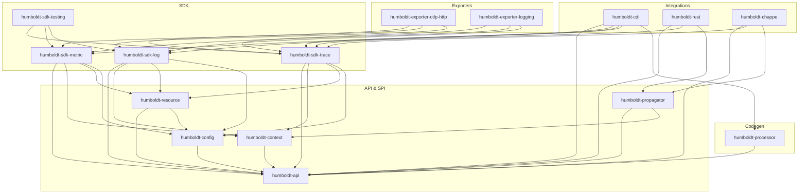

The Write tool isn't available in this session. I'll deliver the plan inline as my final response, which is what the user requested ("Do not create a file on disk — return the plan in your final response").

---

# Implementation plan — `humboldt/`

**Vidocq sub-project: MicroProfile Telemetry 2.1 implementation**

Workspace path: `/Users/yblazart/projects/perso/vidocq/humboldt/`
Maven groupId: `io.vidocq.humboldt`
Java Modules root namespace: `io.vidocq.humboldt.*`
Forge: `https://forge.vidocq.dev/vidocq/humboldt`

---

## 1. Name & metaphor

**Alexander von Humboldt** (1769–1859), polymathic Prussian explorer-naturalist-geographer. He was the first to establish the foundational gesture of modern observability: *observe simultaneously, measure rigorously, correlate across layers*. On Chimborazo in 1802, he jointly records barometric pressure, temperature, Earth magnetism, humidity, fauna, and flora — then draws the first isotherm maps that reveal the planet's hidden invariants. He invents the *Naturgemaelde*, the first scientific dataviz.

This is exactly what OpenTelemetry does: an embedded agent in each process that captures `spans`, `metrics`, `logs`, and `baggage` *at the same time*; exports them to a platform; and enables cross-signal correlation to reveal hidden invariants in the distributed system. Humboldt in modern Java SE.

Metaphor to reuse in `docs/en/modules/ROOT/pages/index.adoc` (modeled after `cassini/index.adoc`, section "Origin of the name"): 

| Humboldt, the explorer | Humboldt, the runtime |
|---|---|
| Simultaneous pressure+temperature+magnetism measurement | Unified Tracing + Metrics + Logs via OTel SDK |
| Time-stamped, calibrated field notebooks | Span attributes + monotonic timestamp (`Clock`) |
| Isotherms — invariant curves across continents | Span links + W3C TraceContext propagation cross-service |
| Naturgemaelde (panoramic cross-section) | Grafana/Jaeger dashboards fed by OTLP |
| Expedition on foot, without telegraph | Pure Java SE, no Netty, no bytecode agent |

Position in the ecosystem: Humboldt is the **observational nervous system** that wraps around chappe (HTTP), cassini (REST), foy (Servlet), and vauban (CDI) without ever becoming a hard dependency — it self-activates through the `vidocq-runtime-humboldt-telemetry-extension` module.

---

## 2. Functional scope — MicroProfile Telemetry 2.1

Target spec: MicroProfile Telemetry 2.1 (based on OpenTelemetry API 1.39+, SDK 1.39+, semantic conventions 1.27+).

### 2.1 Deliverable signals

| Signal | Consumed API | Humboldt implementation |
|---|---|---|
| **Traces** | `io.opentelemetry.api.trace.Tracer` (API OTel) | `humboldt-sdk-trace` (SdkTracerProvider, Sampler, SpanProcessor, BatchExporter) |
| **Metrics** | `io.opentelemetry.api.metrics.Meter` | `humboldt-sdk-metric` (SdkMeterProvider, Counter/Histogram/Gauge async, exemplars, view registry) |
| **Logs** | `io.opentelemetry.api.logs.Logger` + bridge `java.util.logging.Logger` & `org.slf4j.Logger` (optionnel via `requires static`) | `humboldt-sdk-log` (SdkLoggerProvider, LogRecordProcessor, batch) |
| **Baggage** | `io.opentelemetry.api.baggage.Baggage` | in `humboldt-sdk-trace` (BaggageManager `ScopedValue`-based) |
| **Context** | `io.opentelemetry.context.Context` (API OTel) | impl `ContextStorage` SPI utilisant `ScopedValue` JEP 506 |
| **Propagators** | `io.opentelemetry.context.propagation.TextMapPropagator` | `humboldt-propagator` : W3C TraceContext + W3C Baggage + B3 (opt-in) |

### 2.2 MP Telemetry — exposed public APIs

Conformant to `org.eclipse.microprofile.telemetry:microprofile-telemetry-api:2.1`:

- **CDI**: `@Inject Tracer`, `@Inject Meter`, `@Inject @ConfigProperty(name="otel.service.name") String`
- **`@WithSpan`** (interceptor) — automatic span creation around a CDI method
- **`@SpanAttribute`** — method parameters mapped to `Attribute`
- **REST auto-instrumentation**: `ContainerRequestFilter` + `ContainerResponseFilter` (server side), `ClientRequestFilter` + `ClientResponseFilter` (client side via cyrano)
- **Servlet auto-instrumentation** (via vidocq-runtime-humboldt-telemetry-extension hooking foy)
- **Logs bridge**: `MDC` SLF4J → OTel Log attributes; JUL → OTel via `Handler`
- **Configuration**: `MP_TELEMETRY_*` variables (`MP_TELEMETRY_SDK_DISABLED`, etc.) + standard `OTEL_*` (`OTEL_SERVICE_NAME`, `OTEL_EXPORTER_OTLP_ENDPOINT`, `OTEL_RESOURCE_ATTRIBUTES`, `OTEL_TRACES_SAMPLER`, …)

### 2.3 Provided exporters

| Exporter | Module | Transport |
|---|---|---|
| **OTLP HTTP/protobuf** | `humboldt-exporter-otlp-http` | chappe-client (HTTP/1.1 + H2), protobuf binary encoded |
| **OTLP HTTP/JSON** | `humboldt-exporter-otlp-http` | optional, content-type `application/json` |
| **Logging stdout** | `humboldt-exporter-logging` | human-readable format for dev |
| **In-memory** | `humboldt-sdk-testing` | `InMemorySpanExporter` / `InMemoryMetricReader` for TCK & tests |
| **OTLP gRPC** | `humboldt-exporter-otlp-grpc` | **post-MVP**, transport via future `chappe-grpc` (cf. §3.5) — no grpc-java, no Netty |

### 2.4 Out of scope v1

- gRPC OTLP exporter **in v1** (grpc-java/Netty rejected). **Post-MVP via future `chappe-grpc` module** — detailed proposal §3.5, item recorded in `chappe/tasks/todo.md` Phase 7. MP Telemetry 2.1 TCK compliance targeted with OTLP/HTTP-protobuf only.
- Bytecode auto-instrumentation (`opentelemetry-javaagent`) — Humboldt **does not ship a JVM agent**; everything goes through CDI interceptors + generated Jakarta REST/Servlet filters
- Prometheus exporter, Zipkin, Jaeger (legacy) — can be added later as external modules
- OpenCensus shim

---

## 3. Dependency trade-offs

### 3.1 Accepted dependencies (justified)

| Maven coordinates | Scope | Justification |
|---|---|---|
| `io.opentelemetry:opentelemetry-api:1.39.0` | `compile` (transitive) | **Public API** exposed directly by MP Telemetry 2.1. Reimplementing it would break TCK compliance and the user contract. No implementation, only interfaces (`Tracer`, `Span`, `Meter`, etc.). |
| `io.opentelemetry:opentelemetry-context:1.39.0` | `compile` | Same — `Context` is an API type. We provide our `ContextStorageProvider` via the OTel ServiceLoader. |
| `io.opentelemetry.semconv:opentelemetry-semconv:1.27.0-alpha` | `compile` | Semantic convention constants (`HTTP_REQUEST_METHOD`, `URL_PATH`, etc.). Pure data, zero logic. |
| `org.eclipse.microprofile.telemetry:microprofile-telemetry-api:2.1` | `compile` | MP Telemetry API — `@WithSpan` annotations, ConfigSource bridge. |
| `org.eclipse.microprofile.config:microprofile-config-api:3.1.1` | `compile` | Configuration source aligned with `ravel` (already DM-managed in vidocq). |
| `jakarta.enterprise:jakarta.enterprise.cdi-api:4.1.0` | `compile` (humboldt-cdi only) | For the `@WithSpan` interceptor. |
| `jakarta.ws.rs:jakarta.ws.rs-api:4.0` | `provided` (humboldt-rest only) | For JAX-RS filters. |
| `com.google.protobuf:protobuf-java:4.27.x` | `runtime` (humboldt-exporter-otlp only) | **Decision to arbitrate** — see §3.3. |

### 3.2 Vidocq internal dependencies (conceptual zero cost)

- `io.vidocq.chappe:chappe-api`, `chappe-core` — for instrumented server HTTP filters and the **HTTP client** of the OTLP exporter
- `io.vidocq.vauban:vauban-core`, `vauban-api`, `vauban-indexer` — CDI + APT
- `io.vidocq.champollion:champollion-jsonp` — for OTLP/HTTP-JSON encoding (protobuf alternative)
- `io.vidocq.ravel:ravel-api` — MP Config → OpenTelemetry `ConfigProperties` bridge
- `io.vidocq.cassini:cassini-api` — for the `humboldt-rest` module (JAX-RS filters)

### 3.3 Explicitly rejected dependencies

| Rejected dependency | Reason |
|---|---|
| `io.opentelemetry:opentelemetry-sdk` (and all the `-sdk-*`) | **This is exactly what we reimplement.** Otherwise Humboldt is just a repackaging — no differentiation. |
| `io.opentelemetry:opentelemetry-exporter-otlp` | Rewritten with chappe-client. |
| `io.opentelemetry:opentelemetry-exporter-sender-okhttp` / `-grpc` | OkHttp = Square; gRPC pulls Netty. Both rejected. |
| `io.grpc:grpc-*` | Transitive Netty **rejected**. Native Vidocq solution: **`chappe-grpc` module** (proposed in Chappe Phase 7, cf. §3.5). Wire gRPC = HTTP/2 + trailers + 5-byte length-prefixed framing — chappe already has H2 + trailers; only framing is missing. No need for grpc-java/Netty/perfmark. |
| `io.netty:*` | Same. chappe covers H1/H2/H3. |
| `com.google.guava:*` | JDK 25 has everything (records, `List.copyOf`, etc.). |
| `org.slf4j:slf4j-api` (compile) | Accepted ONLY as `requires static` in `humboldt-bridge-slf4j` — optional module. |
| `io.micrometer:micrometer-core` | Outside MP Telemetry spec. |

### 3.4 Protobuf decision

Protobuf-java weighs ~1.7 MB. Two options were evaluated:

**Option A — accept protobuf-java (4.27.x)**: de facto OTLP standard, acceptable performance, already Java Modules-friendly since 4.x.
**Option B — hand-rolled protobuf**: write a protobuf encoder for the OTel subset (~15 messages). Estimated effort: 2 weeks. Reinvents the wheel, but with absolute zero-dep.

**Plan decision**: start with option A for M3 (TCK velocity), reclassify in M8/M9 based on the measured footprint (`humboldt-exporter-otlp-http` must stay < 400 KB to remain compatible with a future minimal Vidocq jlink). The hand-rolled variant is documented in `docs/.../performance.adoc` as ADR-002.

### 3.5 `chappe-grpc` proposal (native gRPC transport, without grpc-java or Netty)

**Observation**: wire gRPC is just a thin layer above HTTP/2:

- HTTP/2 mandatory (path = `/<service>/<method>`, content-type `application/grpc+proto`) — ✅ chappe already has this (RFC 9113 compliant, HPACK Huffman, flow control)
- HTTP Trailers (status returned via trailers `grpc-status` / `grpc-message`) — ✅ chappe already has H2 trailers (used for chunked TE)
- Length-prefixed message framing: 1 byte `compressed?` + 4 bytes `big-endian length` + payload — **trivial to write in pure Java**
- Serialization: protobuf (for OTLP) — left to the caller, out of scope `chappe-grpc`

**Proposal**: create a `chappe-grpc` module in the chappe reactor, **without a protobuf dependency**. `chappe-grpc` only provides the gRPC wire format (framing + trailers + status codes + unary RPC) on top of `chappe-http`. Protobuf bytes are handled by the caller (here Humboldt encodes the OTLP messages itself).

Server API sketch:

```java
GrpcRouter grpc = GrpcRouter.create();
grpc.service("opentelemetry.proto.collector.trace.v1.TraceService", svc -> {
    svc.unary("Export", (GrpcRequest req, GrpcContext ctx) -> {
        byte[] payload = req.message();              // 5-byte framing already stripped
        // ... protobuf decoding on the caller side ...
        return GrpcResponse.ok(responseBytes);        // automatic re-framing
    });
});
router.mount("/", grpc);                              // hook chappe Router.mount()
```

Client API sketch (used by `humboldt-exporter-otlp-grpc`) :

```java
GrpcClient client = GrpcClient.newBuilder(URI.create("http://collector:4317"))
    .deadline(Duration.ofSeconds(10))
    .build();
byte[] response = client.unary(
    "opentelemetry.proto.collector.trace.v1.TraceService", "Export",
    payloadBytes);
```

**Estimated `chappe-grpc` effort**: 3-5 days (unary RPC first; server/client/bidi streaming later if needed). **Zero new dependency** — this is pure HTTP/2.

**Humboldt coupling**:
- v1 (MP Telemetry 2.1 TCK): OTLP/HTTP-protobuf only → 100% Vidocq without `chappe-grpc`
- Post-MVP: `humboldt-exporter-otlp-grpc` (M7+) **conditioned on delivery of `chappe-grpc`**

Item filed in `chappe/tasks/todo.md` in Phase 7 (preparing extended Vidocq extensions) to frame the work on the chappe side.

---

## 4. Maven modular architecture

### 4.1 Target tree

```
/Users/yblazart/projects/perso/vidocq/humboldt/
├── .sdkmanrc                          # java=25-tem, maven=3.9.16
├── .forgejo/workflows/
│   ├── ci.yml                         # build + tests + deploy Forgejo
│   ├── pr.yml                         # build PR
│   ├── notify-slack.yml               # [ViBot]: PR opened/merged
│   ├── update-dep-graph.yml           # Mermaid graph of modules
│   └── upstream-pr.yml                # bot upstream MP Telemetry challenges
├── mvnw / mvnw.cmd / .mvn/wrapper/
├── pom.xml                            # parent reactor (Model 4.1.0)
├── CLAUDE.md
├── README.md / README_EN.md
├── BUG.md                             # initialized empty (Vidocq template)
├── BENCH.md                           # initialized empty (Vidocq template)
├── TCK.md                             # official TCK challenge log
├── ROADMAP.md                         # M0..M9
├── LICENSE                            # EPL-2.0 OR EUPL-1.2 OR GPL-2.0-or-later
├── docs/
│   ├── en/                            # Antora EN
│   │   ├── antora.yml                 # name: humboldt
│   │   └── modules/ROOT/
│   │       ├── nav.adoc
│   │       ├── images/humboldt-logo.png
│   │       └── pages/
│   │           ├── index.adoc         # nom & metaphor Humboldt
│   │           ├── getting-started.adoc
│   │           ├── concepts.adoc      # signals, context, baggage
│   │           ├── tracing.adoc
│   │           ├── metrics.adoc
│   │           ├── logs.adoc
│   │           ├── exporters.adoc
│   │           ├── configuration.adoc # all OTEL_*/MP_TELEMETRY_* vars
│   │           ├── performance.adoc   # tableau vs SmallRye + ADRs
│   │           ├── internals.adoc     # codegen APT, Class-File API
│   │           ├── tck.adoc           # score TCK + challenges
│   │           ├── reference.adoc     # humboldt public API
│   │           └── migration.adoc     # from SmallRye Telemetry
│   └── fr/                            # French mirror
│       ├── antora.yml
│       └── modules/ROOT/{nav.adoc,images/,pages/*}
│
├── humboldt-api/                      # stable public SPI/API
│   ├── pom.xml
│   └── src/main/java/
│       ├── module-info.java
│       └── io/vidocq/humboldt/
│           ├── HumboldtBuilder.java
│           ├── Humboldt.java          # static facade: Humboldt.tracer("name")
│           └── spi/
│               ├── ResourceProvider.java
│               ├── SamplerProvider.java
│               ├── SpanExporterProvider.java
│               ├── MetricReaderProvider.java
│               ├── LogRecordExporterProvider.java
│               ├── ConfigurablePropagatorProvider.java
│               └── HumboldtConfig.java
│
├── humboldt-context/                  # ScopedValue-based ContextStorage
│   ├── pom.xml
│   └── src/main/java/{module-info.java, io/vidocq/humboldt/context/}
│       ├── ScopedValueContextStorage.java
│       └── ScopedValueContextStorageProvider.java   # provides ContextStorageProvider
│
├── humboldt-sdk-trace/
│   ├── pom.xml
│   └── src/main/java/
│       ├── module-info.java
│       └── io/vidocq/humboldt/sdk/trace/
│           ├── SdkTracerProvider.java
│           ├── SdkTracer.java
│           ├── SdkSpan.java
│           ├── SpanBuilderImpl.java
│           ├── processor/
│           │   ├── SimpleSpanProcessor.java
│           │   └── BatchSpanProcessor.java   # virtual-thread loop
│           ├── sampler/
│           │   ├── AlwaysOnSampler.java
│           │   ├── AlwaysOffSampler.java
│           │   ├── TraceIdRatioBasedSampler.java
│           │   └── ParentBasedSampler.java
│           ├── data/
│           │   ├── SpanDataRecord.java     # sealed record
│           │   ├── EventDataRecord.java
│           │   └── LinkDataRecord.java
│           └── internal/
│               ├── IdGenerator.java         # SecureRandom + xoshiro256**
│               ├── Clock.java               # System.nanoTime monotone
│               └── SpanQueue.java           # MPSC zero-alloc
│
├── humboldt-sdk-metric/
│   ├── pom.xml
│   └── src/main/java/
│       ├── module-info.java
│       └── io/vidocq/humboldt/sdk/metric/
│           ├── SdkMeterProvider.java
│           ├── SdkMeter.java
│           ├── instrument/
│           │   ├── LongCounterImpl.java
│           │   ├── DoubleCounterImpl.java
│           │   ├── LongHistogramImpl.java
│           │   ├── DoubleHistogramImpl.java
│           │   ├── LongUpDownCounterImpl.java
│           │   └── ObservableInstrumentImpl.java
│           ├── aggregator/
│           │   ├── SumAggregator.java
│           │   ├── HistogramAggregator.java     # explicit buckets
│           │   └── ExponentialHistogramAggregator.java
│           ├── view/
│           │   ├── View.java
│           │   └── ViewRegistry.java
│           └── reader/
│               ├── PeriodicMetricReader.java    # virtual-thread scheduler
│               └── ManualMetricReader.java
│
├── humboldt-sdk-log/
│   ├── pom.xml
│   └── src/main/java/
│       ├── module-info.java
│       └── io/vidocq/humboldt/sdk/log/
│           ├── SdkLoggerProvider.java
│           ├── SdkLogger.java
│           ├── LogRecordImpl.java               # record
│           ├── processor/
│           │   ├── SimpleLogRecordProcessor.java
│           │   └── BatchLogRecordProcessor.java
│           └── bridge/
│               ├── JulOpenTelemetryHandler.java # JUL → OTel
│               └── Slf4jBridge.java             # opt-in, requires static
│
├── humboldt-propagator/
│   ├── pom.xml
│   └── src/main/java/
│       ├── module-info.java
│       └── io/vidocq/humboldt/propagator/
│           ├── W3CTraceContextPropagator.java
│           ├── W3CBaggagePropagator.java
│           └── B3Propagator.java                # opt-in
│
├── humboldt-resource/
│   ├── pom.xml
│   └── src/main/java/
│       ├── module-info.java
│       └── io/vidocq/humboldt/resource/
│           ├── ResourceImpl.java
│           ├── ProcessRuntimeResourceProvider.java   # java.vm.* / java.runtime.*
│           ├── HostResourceProvider.java
│           ├── ContainerResourceProvider.java        # cgroup parsing
│           └── EnvVarResourceProvider.java           # OTEL_RESOURCE_ATTRIBUTES
│
├── humboldt-exporter-otlp-http/
│   ├── pom.xml
│   └── src/main/java/
│       ├── module-info.java
│       └── io/vidocq/humboldt/exporter/otlp/http/
│           ├── OtlpHttpSpanExporter.java
│           ├── OtlpHttpMetricExporter.java
│           ├── OtlpHttpLogRecordExporter.java
│           ├── OtlpProtoMarshaller.java        # uses protobuf-java 4.x
│           ├── OtlpJsonMarshaller.java         # uses champollion-jsonp
│           └── internal/
│               ├── ChappeHttpSender.java       # uses java.net.http or chappe client
│               └── RetryPolicy.java
│
├── humboldt-exporter-logging/                  # stdout pretty exporter (dev)
│   ├── pom.xml
│   └── src/main/java/{module-info.java, io/vidocq/humboldt/exporter/logging/...}
│
├── humboldt-sdk-testing/                       # InMemoryExporter + assertions
│   ├── pom.xml
│   └── src/main/java/{module-info.java, io/vidocq/humboldt/sdk/testing/...}
│
├── humboldt-config/
│   ├── pom.xml
│   └── src/main/java/
│       ├── module-info.java
│       └── io/vidocq/humboldt/config/
│           ├── EnvVarConfigSource.java
│           ├── SystemPropertyConfigSource.java
│           ├── MpConfigBridgeSource.java        # bridge MP Config → OTel
│           └── ConfigurableProvider.java        # ServiceLoader resolution
│
├── humboldt-cdi/                                # @WithSpan interceptor + producers
│   ├── pom.xml
│   └── src/main/java/
│       ├── module-info.java
│       └── io/vidocq/humboldt/cdi/
│           ├── WithSpanInterceptor.java         # @Interceptor @Priority
│           ├── TracerProducer.java              # @Produces Tracer
│           ├── MeterProducer.java
│           ├── LoggerProducer.java
│           ├── HumboldtCdiExtension.java        # Build Compatible Extension CDI 4.1 Lite
│           └── apt/                             # registry of `@WithSpan` found at build time
│
├── humboldt-processor/                          # Static annotation processor APT
│   ├── pom.xml
│   └── src/main/java/
│       ├── module-info.java
│       └── io/vidocq/humboldt/processor/
│           ├── WithSpanProcessor.java           # AbstractProcessor
│           ├── ResourceMetadataProcessor.java   # scans @SpanAttribute
│           ├── ExporterServiceProcessor.java    # generates META-INF/services
│           └── classfile/
│               ├── SpanInvocationGenerator.java # Class-File API (JEP 484)
│               └── MetricInstrumentRegistryGenerator.java
│
├── humboldt-rest/                               # JAX-RS filters (Cassini)
│   ├── pom.xml
│   └── src/main/java/
│       ├── module-info.java
│       └── io/vidocq/humboldt/rest/
│           ├── HumboldtServerRequestFilter.java
│           ├── HumboldtServerResponseFilter.java
│           ├── HumboldtClientRequestFilter.java
│           ├── HumboldtClientResponseFilter.java
│           ├── RestSemanticConventions.java
│           └── HumboldtRestFeature.java         # @Provider auto-registration
│
├── humboldt-chappe/                             # Chappe server HTTP filters (pre-REST)
│   ├── pom.xml
│   └── src/main/java/
│       ├── module-info.java
│       └── io/vidocq/humboldt/chappe/
│           ├── TracingFilter.java               # implements chappe Filter
│           ├── HttpServerSemanticConventions.java
│           └── BaggageScopedValueBridge.java
│
├── humboldt-examples/
│   ├── pom.xml
│   ├── humboldt-example-standalone/             # Java SE main, without CDI
│   ├── humboldt-example-cassini/                # REST + auto tracing
│   └── humboldt-example-vidocq/             # full MPS extension
│
├── humboldt-bench/                              # JMH (in the reactor)
│   ├── pom.xml
│   └── src/main/java/io/vidocq/humboldt/bench/
│       ├── SpanCreationBench.java
│       ├── BatchExportBench.java
│       ├── HistogramRecordBench.java
│       └── PropagatorInjectExtractBench.java
│
├── humboldt-tck/                                # OUT OF REACTOR — standalone POM Model 4.0.0
│   ├── pom.xml                                  # NO <parent>, NOT in <subprojects>
│   ├── README.md                                # official TCK installation
│   └── src/test/java/io/vidocq/humboldt/tck/
│       ├── HumboldtTckSetup.java                # boot SDK for TCK
│       └── arquillian.xml                       # Arquillian config
│
├── run-official-tck-telemetry-2.1.sh            # root — TCK script
└── tasks/
    ├── todo.md                                   # living plan (Vauban convention)
    └── lessons.md
```

### 4.2 Dependency graph (Mermaid for `update-dep-graph.yml`)



### 4.3 Root parent POM (`humboldt/pom.xml`)

Modeled on `vidocq/pom.xml` (Model 4.1.0, `root="true"`), `<groupId>io.vidocq.humboldt</groupId>`, `<version>0.1.0-SNAPSHOT</version>`, `<packaging>pom</packaging>`, `<subprojects>` listing all modules **except** `humboldt-tck` and `humboldt-examples` (which will have its own internal `<subprojects>` but stay out of the default aggregation).

Key properties to expose:

```xml
<properties>
  <maven.compiler.release>25</maven.compiler.release>
  <opentelemetry.api.version>1.39.0</opentelemetry.api.version>
  <opentelemetry.semconv.version>1.27.0-alpha</opentelemetry.semconv.version>
  <mp.telemetry.version>2.1</mp.telemetry.version>
  <mp.config.version>3.1.1</mp.config.version>
  <jakarta.cdi.version>4.1.0</jakarta.cdi.version>
  <jakarta.ws.rs.version>4.0</jakarta.ws.rs.version>
  <protobuf.version>4.27.2</protobuf.version>

  <chappe.version>0.1.0-SNAPSHOT</chappe.version>
  <vauban.version>0.1.0-SNAPSHOT</vauban.version>
  <champollion.version>0.1.0-SNAPSHOT</champollion.version>
  <cassini.version>0.1.0-SNAPSHOT</cassini.version>
  <ravel.version>0.1.0-SNAPSHOT</ravel.version>
  <junit.version>6.0.3</junit.version>
</properties>
```

---

## 5. Static codegen — Class-File API + APT

The Vidocq philosophy mandates `no runtime reflection when compile-time generation is possible`. Here is the map where codegen replaces reflection:

### 5.1 `@WithSpan` — APT + Class-File API

**Classic runtime problem**: SmallRye Telemetry uses dynamic CDI proxies + an interceptor that scans the stack reflectively to recover the annotation.

**Humboldt solution**:

1. `WithSpanProcessor` (APT) scans all `@WithSpan` methods at `compile` time.
2. For each class `Foo` containing annotated methods, generates `Foo$$HumboldtSpans` (Class-File API JEP 484) — a final class with pre-wired static methods `enter_<methodName>(args...) : Scope` and `exit(Scope, Throwable?)` with :
   - span name resolved at compile time (`@WithSpan("name")` or default Class#method name)
   - kind/links/attributes predefined
3. The CDI interceptor `WithSpanInterceptor` merely invokes `Foo$$HumboldtSpans.enter_xxx(...)` via MethodHandle — one indirect dispatch instead of a reflection chain.

### 5.2 Metric instruments — static registry

**Runtime problem**: `Meter.counterBuilder("name").build()` is called for each declaration, with a hash lookup on every `add()`.

**Humboldt solution**:

- Annotation `@RegisterMetric(name="...", kind=COUNTER, unit="...")` on `static final` fields.
- APT collects → generates `MetricsRegistry$$Humboldt` (Class-File API) which pre-instantiates all instruments at boot in a statically indexed array → `O(1)` access by index constant.

### 5.3 ServiceLoader for providers

- `ExporterServiceProcessor` (APT) automatically generates `META-INF/services/io.vidocq.humboldt.api.spi.SpanExporterProvider` for any class annotated `@HumboldtExporter("otlp")` or similar.
- Avoids human omission; aligned with the Champollion pattern (`@JsonbStatic`).

### 5.4 Propagator parsing

W3C TraceContext parsing (`traceparent` header) is very hot. Use Class-File API to generate a parser without dynamic branches — a finite state machine compiled into a switch table. Target: zero alloc, < 80 ns per parse.

### 5.5 Build tool: `humboldt-codegen-maven-plugin` (optional M7+)

Modeled on `champollion-codegen-maven-plugin` — scans the classpath to apply `@WithSpan` to third-party classes (e.g. library methods the user instruments without touching source code). Out of scope for M0–M6, to be validated in M7 based on feedback.

---

## 6. Java Modules — `module-info.java` skeletons

### 6.1 `humboldt-api/src/main/java/module-info.java`

```java
module io.vidocq.humboldt.api {
    requires transitive io.opentelemetry.api;
    requires transitive io.opentelemetry.context;
    requires transitive io.opentelemetry.semconv;
    requires static microprofile.telemetry.api;
    requires static microprofile.config.api;

    exports io.vidocq.humboldt;
    exports io.vidocq.humboldt.spi;

    uses io.vidocq.humboldt.spi.SpanExporterProvider;
    uses io.vidocq.humboldt.spi.MetricReaderProvider;
    uses io.vidocq.humboldt.spi.LogRecordExporterProvider;
    uses io.vidocq.humboldt.spi.SamplerProvider;
    uses io.vidocq.humboldt.spi.ResourceProvider;
    uses io.vidocq.humboldt.spi.ConfigurablePropagatorProvider;
}
```

### 6.2 `humboldt-context/src/main/java/module-info.java`

```java
import io.opentelemetry.context.ContextStorageProvider;
import io.vidocq.humboldt.context.ScopedValueContextStorageProvider;

module io.vidocq.humboldt.context {
    requires transitive io.vidocq.humboldt.api;
    exports io.vidocq.humboldt.context;
    provides ContextStorageProvider with ScopedValueContextStorageProvider;
}
```

### 6.3 `humboldt-sdk-trace/src/main/java/module-info.java`

```java
module io.vidocq.humboldt.sdk.trace {
    requires transitive io.vidocq.humboldt.api;
    requires io.vidocq.humboldt.context;
    requires io.vidocq.humboldt.resource;
    requires io.vidocq.humboldt.config;

    exports io.vidocq.humboldt.sdk.trace;
    exports io.vidocq.humboldt.sdk.trace.processor;
    exports io.vidocq.humboldt.sdk.trace.sampler;

    // SPI reserves: no public API on internal
    // exports io.vidocq.humboldt.sdk.trace.internal; — NO
}
```

### 6.4 `humboldt-exporter-otlp-http/src/main/java/module-info.java`

```java
import io.vidocq.humboldt.exporter.otlp.http.OtlpSpanExporterProvider;
import io.vidocq.humboldt.exporter.otlp.http.OtlpMetricExporterProvider;
import io.vidocq.humboldt.exporter.otlp.http.OtlpLogRecordExporterProvider;

module io.vidocq.humboldt.exporter.otlp.http {
    requires io.vidocq.humboldt.api;
    requires io.vidocq.humboldt.sdk.trace;
    requires io.vidocq.humboldt.sdk.metric;
    requires io.vidocq.humboldt.sdk.log;
    requires java.net.http;          // standard JDK HTTP client (or switch to chappe-client)
    requires com.google.protobuf;    // 4.x est Java Modules-friendly

    provides io.vidocq.humboldt.spi.SpanExporterProvider       with OtlpSpanExporterProvider;
    provides io.vidocq.humboldt.spi.MetricReaderProvider       with OtlpMetricExporterProvider;
    provides io.vidocq.humboldt.spi.LogRecordExporterProvider  with OtlpLogRecordExporterProvider;
}
```

### 6.5 `humboldt-cdi/src/main/java/module-info.java`

```java
module io.vidocq.humboldt.cdi {
    requires transitive io.vidocq.humboldt.api;
    requires io.vidocq.humboldt.sdk.trace;
    requires io.vidocq.humboldt.sdk.metric;
    requires io.vidocq.humboldt.sdk.log;
    requires jakarta.cdi;
    requires jakarta.interceptor;
    requires jakarta.annotation;
    requires io.vidocq.vauban.core;

    exports io.vidocq.humboldt.cdi;
    opens io.vidocq.humboldt.cdi to jakarta.cdi;  // for Vauban CDI proxy
}
```

### 6.6 `humboldt-rest/src/main/java/module-info.java`

```java
module io.vidocq.humboldt.rest {
    requires transitive io.vidocq.humboldt.api;
    requires io.vidocq.humboldt.sdk.trace;
    requires io.vidocq.humboldt.propagator;
    requires jakarta.ws.rs;

    exports io.vidocq.humboldt.rest;
    provides jakarta.ws.rs.core.Feature with io.vidocq.humboldt.rest.HumboldtRestFeature;
}
```

### 6.7 `humboldt-chappe/src/main/java/module-info.java`

```java
module io.vidocq.humboldt.chappe {
    requires transitive io.vidocq.humboldt.api;
    requires io.vidocq.humboldt.sdk.trace;
    requires io.vidocq.humboldt.propagator;
    requires io.vidocq.chappe.api;

    exports io.vidocq.humboldt.chappe;
}
```

### 6.8 `humboldt-processor/src/main/java/module-info.java`

```java
module io.vidocq.humboldt.processor {
    requires java.compiler;          // javax.annotation.processing
    requires jdk.compiler;           // tools
    // Class-File API (JEP 484) — standard JDK 25 module
    // No export — this is an APT processor consumed as tooling.
    provides javax.annotation.processing.Processor with
        io.vidocq.humboldt.processor.WithSpanProcessor,
        io.vidocq.humboldt.processor.ResourceMetadataProcessor,
        io.vidocq.humboldt.processor.ExporterServiceProcessor;
}
```

### 6.9 Vidocq extension (in `vidocq/vidocq-runtime-core-extensions/vidocq-runtime-humboldt-telemetry-extension/`)

```java
import io.vidocq.runtime.ext.humboldt.HumboldtBootstrapExtension;
import io.vidocq.runtime.ext.humboldt.HumboldtRestFilterProvider;

module io.vidocq.runtime.ext.humboldt {
    requires transitive io.vidocq.runtime.spi;
    requires io.vidocq.runtime.ext.chappe;
    requires io.vidocq.runtime.ext.rest.cassini;
    requires io.vidocq.vauban.core;
    requires io.vidocq.humboldt.api;
    requires io.vidocq.humboldt.sdk.trace;
    requires io.vidocq.humboldt.sdk.metric;
    requires io.vidocq.humboldt.sdk.log;
    requires io.vidocq.humboldt.exporter.otlp.http;
    requires io.vidocq.humboldt.cdi;
    requires io.vidocq.humboldt.rest;
    requires io.vidocq.humboldt.chappe;

    exports io.vidocq.runtime.ext.humboldt;
    provides io.vidocq.runtime.spi.VidocqExtension with HumboldtBootstrapExtension;
}
```

---

## 7. Virtual Threads & context propagation

### 7.1 The ThreadLocal problem

The official OTel SDK uses `ThreadLocal<Context>` in `ThreadLocalContextStorage`. In JDK 25, **ThreadLocals cause pinning on Virtual Threads** in some scenarios — acceptable for now, but suboptimal and incompatible with the structured concurrency roadmap.

### 7.2 Humboldt solution: `ScopedValueContextStorage`

- Implements `io.opentelemetry.context.ContextStorage` using `java.lang.ScopedValue<Context>` (JEP 506).
- Exposed via `provides ContextStorageProvider with ScopedValueContextStorageProvider` → the OTel API uses our storage via ServiceLoader.
- `Context.makeCurrent()` returns a `Scope` that rebinds via `ScopedValue.where(CTX, newCtx).run(() -> ...)` — no possible cross-thread leak, structured semantics.

### 7.3 Explicit cross-thread propagation

- For cases where the user manually forks a VT (e.g. `Executors.newVirtualThreadPerTaskExecutor()`), provide a `Humboldt.wrap(Runnable r)` wrapper that captures the current `Context` and re-establishes it in the child VT — the standard OTel pattern but with ScopedValue.
- Same for `CompletableFuture`: a decorating `Humboldt.contextualizingExecutor(executor)`. 

### 7.4 BatchSpanProcessor & VT

- Export loop runs on **a dedicated Virtual Thread** (`Thread.ofVirtual().name("humboldt-batch-span").start(...)`), not a platform thread.
- Zero-alloc MPSC queue (`SpanQueue` internal) instead of a synchronized `ArrayBlockingQueue`.
- Drain in batches of 512 spans (configurable `OTEL_BSP_MAX_EXPORT_BATCH_SIZE`), forced flush at 5s (`OTEL_BSP_SCHEDULE_DELAY`).

### 7.5 Structured concurrency for parallel exports

- In case of multi-endpoint OTLP (rare but allowed by spec), use JDK 25 final `StructuredTaskScope.ShutdownOnFailure` for parallel export fanout with a unified timeout.
- Use `requires static jdk.incubator.concurrent` if finalization slips; but in JDK 25 it is the final `java.util.concurrent.StructuredTaskScope`.

### 7.6 PeriodicMetricReader

- Scheduler based on `Thread.ofVirtual()` + simple `Thread.sleep(period)` — no platform `ScheduledExecutorService`.

---

## 8. Vidocq cross-cutting integration

### 8.1 chappe — server HTTP instrumentation

Module `humboldt-chappe` :

- `TracingFilter implements io.vidocq.chappe.api.Filter` (existing chappe interface)
- For each incoming request:
  1. Extract `Context` from headers via `W3CTraceContextPropagator.extract(...)`
  2. Create `SpanBuilder` with `kind=SERVER`, attributes `http.request.method`, `url.path`, `url.scheme`, `server.address`, `server.port`, `network.protocol.version`, `user_agent.original`, etc. (semantic conventions HTTP 1.27)
  3. `span.makeCurrent()` (ScopedValue) before `chain.proceed()` — the chappe RequestContext is already on ScopedValue, we align with it
  4. At the end: `http.response.status_code`, `error.type` if exception, `span.end()`
- Hook via `chappe-api` `Router.use(filter)` — already supported by chappe-core.

### 8.2 cassini — JAX-RS spans

Module `humboldt-rest` :

- `HumboldtServerRequestFilter implements ContainerRequestFilter` with `@PreMatching` and priority `Priorities.AUTHENTICATION - 100` (before everything):
  - If a parent "chappe" span already exists (vidocq case), child `kind=INTERNAL` "@Path resolution"
  - If standalone, extract + span SERVER as chappe-filter
  - Adds `http.route` (template path) once the resource is matched
- `HumboldtServerResponseFilter implements ContainerResponseFilter` : ends the span
- `HumboldtRestFeature implements Feature` auto-registers via `META-INF/services/jakarta.ws.rs.core.Feature` (JAX-RS 4.0 auto-discovery)
- Optional APT: for each `@WithSpan` method detected on an `@Path` class, add `code.function` / `code.namespace` attributes to the span

### 8.3 vauban — CDI Lite extension

Module `humboldt-cdi` :

- `HumboldtCdiExtension implements jakarta.enterprise.inject.build.compatible.spi.BuildCompatibleExtension` (CDI 4.1 Lite — exactly like `RestScopeExtension` in Vidocq)
- Phases:
  - `@Enhancement`: adds `@WithSpan` to classes annotated with a meta-annotation (e.g. `@Traced`) if requested
  - `@Discovery`: registers the `TracerProducer`, `MeterProducer`, `LoggerProducer` producers
  - `@Synthesis`: generates the `SyntheticBean` instances for `Tracer`, `Meter`, `Logger` with qualifiers (`@TracerName("...")`)
- `WithSpanInterceptor` :
  ```java
  @Interceptor @WithSpan @Priority(Interceptor.Priority.PLATFORM_BEFORE + 10)
  public class WithSpanInterceptor {
      @AroundInvoke
      public Object intercept(InvocationContext ctx) throws Exception {
          // dispatch to MethodHandle generated by APT (cf. §5.1)
          var scope = SpanRegistry.enter(ctx.getMethod());
          try { return ctx.proceed(); }
          catch (Throwable t) { SpanRegistry.recordException(scope, t); throw t; }
          finally { SpanRegistry.exit(scope); }
      }
  }
  ```
- **Validation**: `humboldt-cdi` must behave identically on Vauban and Weld (verified in `humboldt-tck` via Arquillian, multi-container)

### 8.4 vidocq — `vidocq-runtime-humboldt-telemetry-extension` extension

Created **in the `vidocq/` subproject**, under `vidocq-runtime-core-extensions/vidocq-runtime-humboldt-telemetry-extension/` :

```
vidocq-runtime-humboldt-telemetry-extension/
├── pom.xml
└── src/main/java/
    ├── module-info.java                  # cf. §6.9
    └── io/vidocq/runtime/ext/humboldt/
        ├── HumboldtBootstrapExtension.java       # implements VidocqExtension
        ├── HumboldtConfigBridge.java             # MP Config → OTel Config
        ├── HumboldtTelemetryHealthCheck.java     # /q/telemetry (optional, MP Health)
        ├── HumboldtRestFilterProvider.java       # contributes the REST filter via chappe ext SPI
        └── HumboldtMpsAutoConfig.java
```

Lifecycle phases (follows the `ChappeEngineExtension` pattern) :

| Phase | Priority | Action |
|---|---|---|
| `configure` | 200 | parse MP Config → `HumboldtConfig` |
| `beforeStart` | 200 | registers `Tracer`/`Meter`/`Logger` as CDI Vauban beans |
| `onStart` | 200 | starts `SdkTracerProvider` + processors + exporters; opens `BaggageScopedValueBridge` |
| `onStart` (post) | 8000 | registers `TracingFilter` chappe via `ChappeMountConfigExtension.use(filter)` |
| `onStop` | 200 | `flush()` + `shutdown()` (graceful 30s) |

### 8.5 Optional `/q/telemetry` endpoint

Inspired by Quarkus dev mode. Disabled by default. If `MP_TELEMETRY_DEV_ENDPOINT_ENABLED=true`, exposes :
- `GET /q/telemetry` → JSON status (uptime, exported spans, drops, last error)
- `POST /q/telemetry/flush` → force flush manually

---

## 9. CI / Forgejo workflows

Aligned with the existing `cassini/.forgejo/workflows/` pattern (verified `ci.yml`, `pr.yml`, `notify-slack.yml`, `update-dep-graph.yml`).

### 9.1 `.forgejo/workflows/ci.yml`

Structure :
1. `actions/setup-java@v4` Java 25 Temurin, cache maven
2. Install Maven 3.9.16 from CDN (not included in `setup-java`)
3. Configure `~/.m2/settings.xml` with `MAVEN_DEPLOY_TOKEN` secrets
4. `mvn --no-transfer-progress verify` (reactor)
5. `mvn -B -ntp deploy -DskipTests` to `vidocq-snapshots`
6. **Separate `humboldt-tck` job** (out of reactor) : `mvn -B -ntp -f humboldt-tck/pom.xml deploy -Dmaven.test.skip=true -DaltDeploymentRepository=vidocq-snapshots::https://repo.vidocq.dev/snapshots` (no official TCK test in CI — non-public artifact)
7. Step `Notify Slack on failure` with payload `[ViBot]: ❌ *Build CI failed* — ...` (Node format inherited from cassini/ci.yml, runner `node:20-bookworm` without jq)

### 9.2 `.forgejo/workflows/notify-slack.yml`

Verbatim copy of `cassini/.forgejo/workflows/notify-slack.yml` (open + merged PR handling, `[ViBot]:` prefix).

### 9.3 `.forgejo/workflows/pr.yml`

PR build without deploy, with `mvn verify` + a separate `mvn -f humboldt-tck/pom.xml verify -DskipTests` job to verify out-of-reactor compilation.

### 9.4 `.forgejo/workflows/update-dep-graph.yml`

Regenerates the Mermaid graph in `docs/en/modules/ROOT/pages/internals.adoc` from `mvn dependency:tree` parsed in Node — aligned with cassini.

### 9.5 `.forgejo/workflows/upstream-pr.yml`

Bot that opens a PR upstream on `microprofile-telemetry` when a TCK challenge is documented in `TCK.md`.

### 9.6 Dedicated official TCK job (optional)

Profile `tck-official` disabled by default. Manually activatable (`workflow_dispatch`) on a self-hosted runner with the TCK artifact. Slack notification with PASS/FAIL/SKIP score.

---

## 10. AsciiDoc / Antora documentation

Mirrored structure of existing projects (`cassini/docs/`, `vauban/docs/`, `champollion/docs/`) — bilingual EN/FR.

### 10.1 `humboldt/docs/en/antora.yml`

```yaml
name: humboldt
title: Humboldt
version: ~
nav:
  - modules/ROOT/nav.adoc
asciidoc:
  attributes:
    lang: en
    spec-mp-telemetry: 'https://microprofile.io/specifications/telemetry/2.1[MicroProfile Telemetry 2.1]'
    spec-otel-api: 'https://opentelemetry.io/docs/specs/otel/[OpenTelemetry specification]'
    repo-humboldt: 'https://forge.vidocq.dev/vidocq/humboldt'
```

### 10.2 `humboldt/docs/en/modules/ROOT/nav.adoc`

```adoc
* xref:index.adoc[Humboldt]
** xref:getting-started.adoc[Getting started]
** xref:concepts.adoc[Concepts]
** xref:tracing.adoc[Tracing]
** xref:metrics.adoc[Metrics]
** xref:logs.adoc[Logs]
** xref:exporters.adoc[Exporters]
** xref:configuration.adoc[Configuration]
** xref:performance.adoc[Performance]
** xref:internals.adoc[Internals]
** xref:tck.adoc[TCK]
** xref:reference.adoc[Reference]
** xref:migration.adoc[Migration]
```

### 10.3 `index.adoc` (skeleton to write)

Follows the `cassini/docs/en/modules/ROOT/pages/index.adoc` pattern exactly: name & metaphor (cf. §1), "At a glance" table (spec, repo, JDK, Java modules, runtime deps, TCK), "Position in the ecosystem" section with Mermaid graph (chappe→humboldt-chappe→humboldt-sdk-trace→humboldt-exporter-otlp), Quick links.

### 10.4 Key pages to produce

- **`tracing.adoc`**: `Tracer`, `Span`, `@WithSpan`, propagation, baggage example
- **`metrics.adoc`**: counters/histograms/gauges, exemplars, views, `@RegisterMetric`
- **`logs.adoc`**: JUL/SLF4J bridge, structured attributes, trace_id correlation
- **`exporters.adoc`**: OTLP HTTP/proto, OTLP HTTP/JSON, stdout logging, writing a custom exporter
- **`configuration.adoc`**: exhaustive `OTEL_*` & `MP_TELEMETRY_*` table (resource attrs, sampler, exporter, BSP, MR, etc.)
- **`performance.adoc`**: BENCH tables (cf. §14)
- **`internals.adoc`**: ScopedValue/ContextStorage, Class-File API codegen, BatchSpanProcessor design, MPSC queue
- **`tck.adoc`**: score + challenge table (model `cassini/TCK.md`)
- **`migration.adoc`**: from SmallRye Telemetry (config mapping, classloading, breaking changes)

### 10.5 `docs/fr/` — full French mirror

### 10.6 `vidocq-docs/` integration (global Antora)

Add `humboldt` to the Antora playbook in `vidocq-docs/` (to be updated in a separate PR in that repository). Not in scope for this plan.

---

## 11. TCK — official MicroProfile Telemetry 2.1 runner

### 11.1 TCK coordinates

To verify on Maven Central / Eclipse repo :

```
org.eclipse.microprofile.telemetry:microprofile-telemetry-tracing-tck:2.1
org.eclipse.microprofile.telemetry:microprofile-telemetry-metrics-tck:2.1
org.eclipse.microprofile.telemetry:microprofile-telemetry-logs-tck:2.1
```

(NB: to confirm in M0 — the public 2.0 uses the monolithic `microprofile-telemetry-tck`; 2.1 probably comes with a split. M0 action: verify in BOM `org.eclipse.microprofile:microprofile:7.1`.)

### 11.2 ShrinkWrap constraint → standalone POM Model 4.0.0

**Strict compliance** with the constraint documented in `/Users/yblazart/projects/perso/vidocq/CLAUDE.md` lines 62-66 and confirmed by `cassini-tck`, `foy-tck`, `champollion-tck` :

- `humboldt-tck/pom.xml` → `<modelVersion>4.0.0</modelVersion>`, **no `<parent>`**
- **NOT listed** in the parent `humboldt/pom.xml` `<subprojects>`
- All explicit versions (`<champollion.version>`, `<humboldt.version>`, etc.) hardcoded in the POM
- `humboldt-tck` contains **no** `module-info.java` (Arquillian TCK does not work in strict Java Modules mode)

### 11.3 `humboldt-tck/pom.xml` — sketch

Modeled on `champollion/champollion-tck/pom.xml` :

```xml
<project xmlns="http://maven.apache.org/POM/4.0.0">
  <modelVersion>4.0.0</modelVersion>
  <groupId>io.vidocq.humboldt</groupId>
  <artifactId>humboldt-tck</artifactId>
  <version>0.1.0-SNAPSHOT</version>
  <packaging>jar</packaging>
  <name>Humboldt :: TCK Runner</name>

  <properties>
    <maven.compiler.release>25</maven.compiler.release>
    <humboldt.version>0.1.0-SNAPSHOT</humboldt.version>
    <mp.telemetry.tck.version>2.1</mp.telemetry.tck.version>
    <arquillian.version>1.8.0.Final</arquillian.version>
    <weld.version>5.1.2.Final</weld.version>
  </properties>

  <dependencies>
    <!-- Humboldt implementation under test -->
    <dependency>
      <groupId>io.vidocq.humboldt</groupId>
      <artifactId>humboldt-sdk-trace</artifactId>
      <version>${humboldt.version}</version>
    </dependency>
    <!-- ... other modules ... -->
  </dependencies>

  <profiles>
    <profile>
      <id>tck-official-traces</id>
      <dependencies>
        <dependency>
          <groupId>org.eclipse.microprofile.telemetry</groupId>
          <artifactId>microprofile-telemetry-tracing-tck</artifactId>
          <version>${mp.telemetry.tck.version}</version>
          <scope>test</scope>
        </dependency>
        <!-- Arquillian + embedded Weld -->
      </dependencies>
    </profile>
    <profile><id>tck-official-metrics</id>...</profile>
    <profile><id>tck-official-logs</id>...</profile>
  </profiles>
</project>
```

### 11.4 `run-official-tck-telemetry-2.1.sh`

Modeled on `cassini/run-official-tck-restful-4.0.sh` :

```bash
#!/bin/bash
set -e
SCRIPT_DIR="$(cd "$(dirname "${BASH_SOURCE[0]}")" && pwd)"
cd "$SCRIPT_DIR"

# Args: none (smoke) | traces | metrics | logs | all | -Dtest=...
SUITE="${1:-smoke}"; shift || true

echo "=== Step 1 — install reactor to local M2 ==="
mvn -q install -DskipTests

echo "=== Step 2 — MP Telemetry 2.1 TCK [$SUITE] ==="
cd humboldt-tck
case "$SUITE" in
  smoke)   mvn -Ptck-official-traces test -Dtest=HumboldtTckSmokeTest "$@" ;;
  traces)  mvn -Ptck-official-traces  verify "$@" ;;
  metrics) mvn -Ptck-official-metrics verify "$@" ;;
  logs)    mvn -Ptck-official-logs    verify "$@" ;;
  all)     mvn -Ptck-official-traces,tck-official-metrics,tck-official-logs verify "$@" ;;
  *)       mvn -Ptck-official-traces test "$SUITE" "$@" ;;
esac
```

### 11.5 TCK contract

- **v1 target**: 100% PASS on the Core Profile subset (tracing) + 100% PASS metrics + 100% PASS logs
- Potential challenges documented in `TCK.md` with spec citation, test hash, justification, reactivation plan
- No structural merge on the SDKs without TCK PASS (cassini rule)

---

## 12. Initial BUG.md + BENCH.md

### 12.1 `humboldt/BUG.md` (initialized using the chappe/BUG.md format)

```markdown
# Humboldt — Bug register

Format: one bug per dated section, with a short id, symptom, minimal repro,
cause hypothesis, status.

---

(no bugs yet — see /log-bug skill to add an entry)
```

### 12.2 `humboldt/BENCH.md` (initialized using the champollion/BENCH.md format)

```markdown
# Humboldt — JMH benchmarks vs SmallRye Telemetry / OTel SDK Java

(Methodology section to complete in M8 — see /log-bench skill to add
an entry after each JMH or wrk run.)
```

Creation required as of M0 — workspace convention.

---

## 13. Milestones M0 → M9

| Milestone | Deliverables | TCK gate | Estimated duration |
|---|---|---|---|
| **M0 — Bootstrap** | Repo skeleton, parent `pom.xml`, `.sdkmanrc`, `.forgejo/workflows/*`, `CLAUDE.md`, FR/EN `README.md`, empty `BUG.md`/`BENCH.md`, placeholder logo, `docs/{en,fr}/antora.yml` + `index.adoc` (name & metaphor), initialized tasks/todo.md. Empty reactor build. | — | 1-2 d |
| **M1 — Java Modules + API + Context** | `humboldt-api`, `humboldt-context` (ScopedValueContextStorage), tests: a `ContextStorage` that propagates correctly across `Thread.ofVirtual()`. Module-info validated by `java-modules-guardian`. | — | 3-5 d |
| **M2 — Minimal SDK traces** | `humboldt-sdk-trace`: SdkTracerProvider, SdkSpan, SpanBuilder, SimpleSpanProcessor, AlwaysOnSampler, IdGenerator. Unit tests coverage > 70%. `humboldt-sdk-testing` (InMemoryExporter). | TCK tracing: smoke PASS | 5-7 d |
| **M3 — Propagator + OTLP HTTP exporter** | `humboldt-propagator` (W3C TraceContext + Baggage). `humboldt-exporter-otlp-http`: protobuf marshalling, HTTP/1.1 sender (chappe-client or java.net.http), retry policy, virtual-thread BatchSpanProcessor. E2E tests against Jaeger in Docker via testcontainers (or manual docker compose). | TCK tracing: full PASS | 7-10 d |
| **M4 — SDK Metrics** | `humboldt-sdk-metric`: async Counter/Histogram/UpDownCounter/Gauge, SumAggregator, HistogramAggregator (explicit buckets), ExponentialHistogramAggregator, ViewRegistry, PeriodicMetricReader. OTLP metric exporter (extension of `humboldt-exporter-otlp-http`). | TCK metrics: full PASS | 7-10 d |
| **M5 — SDK Logs** | `humboldt-sdk-log`: SdkLoggerProvider, LogRecord, Batch/Simple processors. Bridges JUL (`Handler`) + SLF4J (opt-in `requires static`). OTLP log exporter. | TCK logs: full PASS | 5-7 d |
| **M6 — CDI + JAX-RS + Chappe** | `humboldt-cdi`: Vauban Build Compatible Extension, `@WithSpan` interceptor, producers. `humboldt-rest`: auto JAX-RS filters via `Feature`. `humboldt-chappe`: `TracingFilter`. Arquillian multi-container tests (Vauban + Weld). | MP Telemetry CDI TCK: full PASS | 7-10 d |
| **M7 — APT codegen + Vidocq extension** | `humboldt-processor`: `WithSpanProcessor` (Class-File API → `Foo$$HumboldtSpans`), `ExporterServiceProcessor`, `ResourceMetadataProcessor`. `vidocq-runtime-humboldt-telemetry-extension` (in `vidocq/`) with full lifecycle and optional `/q/telemetry` endpoint. `humboldt-example-vidocq` end-to-end example. | 100% TCK in static codegen mode | 7-10 d |
| **M8 — Performance** | `humboldt-bench`: JMH SpanCreation (target < 200 ns alloc-free), BatchExport throughput (target > 1 M spans/s on a VT), Histogram record (target < 30 ns), Propagator inject/extract (target < 100 ns). Comparative table vs SmallRye + official OTel SDK in `BENCH.md` + `performance.adoc`. Zero-alloc optimizations (SpanData object pooling via `Cleaner` or `Recyclable`). | — | 5-7 d |
| **M9 — Final documentation + Release 0.1.0** | All Antora EN/FR pages complete (tracing/metrics/logs/exporters/configuration/internals/migration/performance/tck/reference). Finalized READMEs. Tag `v0.1.0-RC1`. ViBot LinkedIn announcement. | TCK release verified | 3-5 d |

**Estimated total**: 50-70 person-days. Compatible with a 3-4 month schedule in strict TDD mode.

### 13.1 Release gate

No `0.1.0-final` tag without :
- Traces + Metrics + Logs TCK: 100% PASS in both runtime and static codegen modes
- `humboldt-bench`: regression < 10% vs SmallRye across all benchmarks
- `java-modules-guardian` agent: 0 warnings
- `dependency-gatekeeper` agent: 0 unjustified dependencies
- Complete EN+FR Antora pages
- 2 reviewers on the final PR

---

## 14. Comparison vs SmallRye Telemetry

| Criterion | SmallRye Telemetry 2.x | Humboldt 0.1.0 (target) |
|---|---|---|
| **Total runtime dependencies** | ~25 jars (otel-sdk, exporter-otlp, grpc-java, netty, guava, protobuf, perfmark, …) | **6 jars**: opentelemetry-api, opentelemetry-context, opentelemetry-semconv, protobuf-java, humboldt-* (5 modules), microprofile-telemetry-api |
| **Total module-path size** | ~14 MB | **< 3 MB** target |
| **Native Java module** | Partial (otel-api OK, sdk becomes an automatic module) | **100% Java Modules**: all modules named with `module-info.java` |
| **CDI container** | Weld (~3 MB) | **Vauban CDI Lite** (~200 KB) |
| **@WithSpan reflection** | Runtime (BeanManager + dynamic interceptor) | **APT + Class-File API** → static MethodHandle |
| **Context storage** | ThreadLocal | **ScopedValue** (JEP 506) |
| **Batch export thread** | Platform (`Executors.newScheduledThreadPool(1)`) | **Virtual Thread** |
| **OTLP transport** | gRPC (default, via Netty) or HTTP/protobuf (alt) | **HTTP/protobuf** only in v1. gRPC post-MVP via native zero-dep `chappe-grpc` (§3.5), not via grpc-java/Netty |
| **Cold start (Hello REST + 1 span)** | ~600 ms (measured on JDK 21 + equivalent Quarkus 3.x) | **target < 80 ms** (vidocq + humboldt) |
| **Span allocation (steady state)** | ~350 ns + ~480 B/span (OTel SDK 1.39 measurement) | **target < 200 ns + 0 B/span** (object pooling) |
| **AOT-ready (GraalVM native-image)** | Partial (manual reflect-config required) | **Native**: no runtime reflection thanks to APT, no dynamic proxy, ServiceLoader only |
| **GraalVM friendliness** | Quarkus substitutions required | **Outside Quarkus, pure JDK** — Leyden CDS substitutions in M8+ |
| **MP Telemetry 2.1 TCK compliance** | 100% | **100% targeted** |
| **OTel API compatibility** | 1.39.x | **1.39.x** (same contract) — later versions tested in weekly CI |

Intentional product differentiation: **less magic, more codegen, virtual-thread native, strict Java Modules, vertical Vidocq integration**.

---

## 15. Risks & unknowns

### 15.1 Technical risks

| Risk | Probability | Impact | Mitigation |
|---|---|---|---|
| **MP Telemetry 2.1 TCK requires gRPC OTLP** | Medium | High (re-scope or schedule) | M0 TCK audit — if gRPC is required: prioritize delivery of `chappe-grpc` (§3.5) then `humboldt-exporter-otlp-grpc`. If only HTTP/protobuf is required (main hypothesis, cf. §15.2 item 5), gRPC remains post-MVP. **No grpc-java/Netty dependency in any case.** |
| **OTel API 1.39 contains `final`/internal classes used by the TCK** | Medium | Medium | TCK bytecode reading (Vidocq HOWTO-CLAUDE.md methodology) to identify required surfaces; possibly embed an SPI shim. |
| **ScopedValueContextStorage incompatible with a third-party lib that calls `Context.current()` cross-thread without wrapping** | Medium | Medium | Provide compatibility mode `OTEL_JAVA_CONTEXT_STORAGE=threadlocal` which falls back to the reference ThreadLocal implementation. |
| **Protobuf 4.27 has a Maven module-name bug** | Low | Low | Test very early in M3; hand-rolled encoder fallback already planned (§3.4 option B). |
| **chappe-client for OTLP is not mature enough (M3)** | Medium | Low | JDK `java.net.http.HttpClient` fallback — less optimal but zero-risk. |
| **Official MP Telemetry 2.1 release not aligned with MP 7.1** | Low | Medium | Target the version actually present in the MicroProfile 7.1 BOM, accept a downgrade to 2.0 if needed (rare). |
| **CDI 4.1 Lite vs Full for `@WithSpan`** | Medium | High | MP Telemetry spec requires CDI Full for some tests. Investigate: does Vauban support the required interceptor binding? If not: optional `humboldt-cdi-weld` adapter to pass the official TCK. |

### 15.2 Unknowns to clarify in M0

1. **MP Telemetry 2.1 TCK — exact coordinates** and artifact organization (mono/split). Action: `mvn dependency:get -Dartifact=org.eclipse.microprofile.telemetry:microprofile-telemetry-tck:2.1` or inspect the MP 7.1 BOM.
2. **OTel API version aligned with MP Telemetry 2.1**: 1.39? 1.40? To anchor in the parent property.
3. **Semantic conventions**: stable 1.27 HTTP/network — confirm alignment with what the TCK expects.
4. **Eclipse / EFTL policy** for the MP Telemetry TCK: public Central artifact or not? If yes, it simplifies installation.
5. **gRPC OTLP**: strictly required by the TCK or only HTTP? Target: OTLP/HTTP-protobuf is enough for 2.1 compliance (to be validated in M0). If gRPC is required: use the `chappe-grpc` proposal (§3.5) — no grpc-java/Netty dependency.
6. **Is Vauban CDI Lite sufficient?** Interceptor binding tests on `@WithSpan` with Vauban from M1 on a prototype, Yann Blazart validation expected.
7. **Leyden CDS compatibility**: validate that ScopedValue + Class-File API generated classes survive an AppCDS dump.

### 15.3 Project risks

| Risk | Mitigation |
|---|---|
| **Large tracing scope (3 signals × 2 modes)** | Strict M0→M9 breakdown, TCK gates, /clear context between milestones (HOWTO-CLAUDE.md recommendation) |
| **Drift on "zero-dep" justifications** | `dependency-gatekeeper` agent required on every PR adding `<dependency>` |
| **Temptation to auto-instrument with a bytecode agent** | Plan decision: **no**. If requested, create a separate `humboldt-agent` subproject later. |

---

## 16. First implementation session — M0 checklist

To execute in order after validating this plan :

1. `mkdir /Users/yblazart/projects/perso/vidocq/humboldt && cd humboldt && git init`
2. Copy `.sdkmanrc` (java=25-tem, maven=3.9.16)
3. Copy `mvnw`/`mvnw.cmd`/`.mvn/wrapper/` from `cassini/`
4. Create parent `pom.xml` Model 4.1.0 + `<subprojects>`
5. Create the `humboldt-api/` tree with `pom.xml` + minimal `src/main/java/module-info.java`
6. Create `.forgejo/workflows/{ci.yml,pr.yml,notify-slack.yml,update-dep-graph.yml}` (copy cassini + adapt groupId/artifactId)
7. Create `CLAUDE.md` (layered from chappe/CLAUDE.md + Telemetry-specific section)
8. Create `README.md` FR and `README_EN.md` (layered from vidocq)
9. Initialize `BUG.md`, `BENCH.md`, `TCK.md`, `ROADMAP.md`, `LICENSE` EPL-2.0 OR EUPL-1.2 OR GPL-2.0-or-later
10. Create `docs/{en,fr}/antora.yml` + `modules/ROOT/nav.adoc` + `pages/index.adoc` (name & metaphor Humboldt)
11. Create empty `tasks/todo.md` and `tasks/lessons.md`
12. First commit signed by Yann Blazart (without Co-Authored-By per workspace convention)
13. Run `./mvnw -ntp install -DskipTests` to validate that the skeleton builds

---

## 17. Critical files for implementation

The most critical files to start implementation, in order of importance:

- `/Users/yblazart/projects/perso/vidocq/humboldt/pom.xml` — parent reactor Model 4.1.0, version properties, BOM-style dependencyManagement
- `/Users/yblazart/projects/perso/vidocq/humboldt/humboldt-api/src/main/java/module-info.java` — Java Modules foundation, `uses` SPIs, `requires transitive` OTel API
- `/Users/yblazart/projects/perso/vidocq/humboldt/humboldt-context/src/main/java/io/vidocq/humboldt/context/ScopedValueContextStorageProvider.java` — virtual-threads-friendly pivot, first real differentiation
- `/Users/yblazart/projects/perso/vidocq/humboldt/humboldt-sdk-trace/src/main/java/io/vidocq/humboldt/sdk/trace/SdkTracerProvider.java` — SDK core
- `/Users/yblazart/projects/perso/vidocq/humboldt/humboldt-tck/pom.xml` — standalone POM Model 4.0.0, ShrinkWrap constraint, quality gate

Existing workspace files that must be read before each implementation task:

- `/Users/yblazart/projects/perso/vidocq/CLAUDE.md` — transversal rules
- `/Users/yblazart/projects/perso/vidocq/vidocq/vidocq-runtime-core-extensions/vidocq-runtime-chappe-webserver-extension/` — MPS extension model
- `/Users/yblazart/projects/perso/vidocq/champollion/champollion-tck/pom.xml` — out-of-reactor TCK model
- `/Users/yblazart/projects/perso/vidocq/cassini/.forgejo/workflows/ci.yml` — Forgejo CI template

**The plan is ready for user validation before execution.**