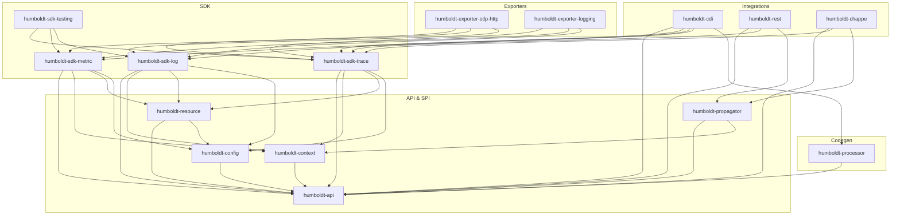

The Write tool isn't available in this session. I'll deliver the plan inline as my final response, which is what the user requested ("Ne crée pas de fichier sur disque — retourne le plan dans ta réponse finale").

---

# Plan d'implémentation — `humboldt/`

**Sous-projet Vidocq : MicroProfile Telemetry 2.1 implementation**

Workspace path: `/Users/yblazart/projects/perso/vidocq/humboldt/`
Maven groupId: `io.vidocq.humboldt`
JPMS namespace racine: `io.vidocq.humboldt.*`
Forge: `https://forge.vidocq.dev/vidocq/humboldt`

---

## 1. Nom & métaphore

**Alexander von Humboldt** (1769–1859), polymathe prussien, naturaliste-explorateur-géographe. Il est l'homme qui a posé pour la première fois le geste fondamental de l'observabilité moderne : *observer simultanément, mesurer rigoureusement, corréler à travers les couches*. Sur le Chimborazo en 1802, il enregistre conjointement la pression barométrique, la température, le magnétisme terrestre, l'humidité, la faune, la flore — puis trace les premières cartes isothermes qui révèlent les invariants cachés de la planète. Il invente la *Naturgemälde*, la première dataviz scientifique.

C'est exactement ce que fait OpenTelemetry : un agent embarqué dans chaque processus qui capture *en même temps* `spans`, `metrics`, `logs`, `baggage` ; les exporte vers une plateforme ; et permet la corrélation cross-signal pour révéler les invariants cachés du système distribué. Humboldt en Java SE moderne.

Métaphore à reprendre dans `docs/en/modules/ROOT/pages/index.adoc` (calque du `cassini/index.adoc`, section "Origin of the name") :

| Humboldt, l'explorateur | Humboldt, le runtime |
|---|---|
| Mesure simultanée pression+température+magnétisme | Tracing + Metrics + Logs unifiés via OTel SDK |
| Carnets de terrain horodatés, calibrés | Span attributes + timestamp monotone (`Clock`) |
| Isothermes — courbes d'invariants à travers continents | Span links + W3C TraceContext propagation cross-service |
| Naturgemälde (cross-section panoramique) | Dashboards Grafana/Jaeger alimentés par OTLP |
| Expédition à pied, sans télégraphe | Java SE pur, pas de Netty, pas d'agent bytecode |

Position dans l'écosystème : Humboldt est le **système nerveux observationnel** qui s'enroule autour de chappe (HTTP), cassini (REST), foy (Servlet), vauban (CDI) sans jamais s'imposer comme dépendance dure — il s'auto-active via le module `vidocq-mps-humboldt-extension`.

---

## 2. Périmètre fonctionnel — MicroProfile Telemetry 2.1

Spec cible : MicroProfile Telemetry 2.1 (basée sur OpenTelemetry API 1.39+, SDK 1.39+, sémantique conventions 1.27+).

### 2.1 Signaux livrables

| Signal | API consommée | Implémentation Humboldt |
|---|---|---|
| **Traces** | `io.opentelemetry.api.trace.Tracer` (API OTel) | `humboldt-sdk-trace` (SdkTracerProvider, Sampler, SpanProcessor, BatchExporter) |
| **Metrics** | `io.opentelemetry.api.metrics.Meter` | `humboldt-sdk-metric` (SdkMeterProvider, Counter/Histogram/Gauge async, exemplars, view registry) |
| **Logs** | `io.opentelemetry.api.logs.Logger` + bridge `java.util.logging.Logger` & `org.slf4j.Logger` (optionnel via `requires static`) | `humboldt-sdk-log` (SdkLoggerProvider, LogRecordProcessor, batch) |
| **Baggage** | `io.opentelemetry.api.baggage.Baggage` | dans `humboldt-sdk-trace` (BaggageManager `ScopedValue`-based) |
| **Context** | `io.opentelemetry.context.Context` (API OTel) | impl `ContextStorage` SPI utilisant `ScopedValue` JEP 506 |
| **Propagators** | `io.opentelemetry.context.propagation.TextMapPropagator` | `humboldt-propagator` : W3C TraceContext + W3C Baggage + B3 (opt-in) |

### 2.2 MP Telemetry — APIs publiques exposées

Conformes à `org.eclipse.microprofile.telemetry:microprofile-telemetry-api:2.1`:

- **CDI** : `@Inject Tracer`, `@Inject Meter`, `@Inject @ConfigProperty(name="otel.service.name") String`
- **`@WithSpan`** (interceptor) — création automatique de span autour d'une méthode CDI
- **`@SpanAttribute`** — paramètres de méthode mappés en `Attribute`
- **Auto-instrumentation REST** : `ContainerRequestFilter` + `ContainerResponseFilter` (server side), `ClientRequestFilter` + `ClientResponseFilter` (client side via cyrano)
- **Auto-instrumentation Servlet** (via vidocq-mps-humboldt-extension hooking foy)
- **Logs bridge** : `MDC` SLF4J → OTel Log attributes ; JUL → OTel via `Handler`
- **Configuration** : variables `MP_TELEMETRY_*` (`MP_TELEMETRY_SDK_DISABLED`, etc.) + `OTEL_*` standard (`OTEL_SERVICE_NAME`, `OTEL_EXPORTER_OTLP_ENDPOINT`, `OTEL_RESOURCE_ATTRIBUTES`, `OTEL_TRACES_SAMPLER`, …)

### 2.3 Exporters fournis

| Exporter | Module | Transport |
|---|---|---|
| **OTLP HTTP/protobuf** | `humboldt-exporter-otlp-http` | chappe-client (HTTP/1.1 + H2), protobuf binary encoded |
| **OTLP HTTP/JSON** | `humboldt-exporter-otlp-http` | optionnel, content-type `application/json` |
| **Logging stdout** | `humboldt-exporter-logging` | format human-readable pour dev |
| **In-memory** | `humboldt-sdk-testing` | `InMemorySpanExporter` / `InMemoryMetricReader` pour TCK & tests |
| **OTLP gRPC** | `humboldt-exporter-otlp-grpc` | **post-MVP**, transport via futur `chappe-grpc` (cf. §3.5) — pas de grpc-java, pas de Netty |

### 2.4 Hors-scope v1

- gRPC OTLP exporter **en v1** (grpc-java/Netty refusés). **Post-MVP via futur module `chappe-grpc`** — proposition détaillée §3.5, item déposé dans `chappe/tasks/todo.md` Phase 7. Conformité TCK MP Telemetry 2.1 visée avec OTLP/HTTP-protobuf seul.
- Auto-instrumentation bytecode (`opentelemetry-javaagent`) — Humboldt **ne livre pas d'agent JVM** ; tout passe par CDI interceptors + filtres Jakarta REST/Servlet codegen
- Prometheus exporter, Zipkin, Jaeger (legacy) — peuvent être ajoutés comme modules externes plus tard
- OpenCensus shim

---

## 3. Arbitrage dépendances

### 3.1 Dépendances acceptées (justifiées)

| Coordonnées Maven | Scope | Justification |
|---|---|---|
| `io.opentelemetry:opentelemetry-api:1.39.0` | `compile` (transitive) | **API publique** que la spec MP Telemetry 2.1 expose directement. La réimplementer = casser la conformité TCK et le contrat utilisateur. Pas d'implémentation, juste les interfaces (`Tracer`, `Span`, `Meter`, etc.). |
| `io.opentelemetry:opentelemetry-context:1.39.0` | `compile` | Idem — `Context` est un type d'API. On fournit notre `ContextStorageProvider` via ServiceLoader OTel. |
| `io.opentelemetry.semconv:opentelemetry-semconv:1.27.0-alpha` | `compile` | Constantes des conventions sémantiques (`HTTP_REQUEST_METHOD`, `URL_PATH`, etc.). Pure-data, zéro logique. |
| `org.eclipse.microprofile.telemetry:microprofile-telemetry-api:2.1` | `compile` | API MP Telemetry — annotations `@WithSpan`, ConfigSource bridge. |
| `org.eclipse.microprofile.config:microprofile-config-api:3.1.1` | `compile` | Source de configuration cohérente avec `ravel` (déjà DM-managé dans vidocq-mps). |
| `jakarta.enterprise:jakarta.enterprise.cdi-api:4.1.0` | `compile` (humboldt-cdi seulement) | Pour l'interceptor `@WithSpan`. |
| `jakarta.ws.rs:jakarta.ws.rs-api:4.0` | `provided` (humboldt-rest seulement) | Pour les filtres JAX-RS. |
| `com.google.protobuf:protobuf-java:4.27.x` | `runtime` (humboldt-exporter-otlp seulement) | **Décision arbitrable** — voir §3.3. |

### 3.2 Dépendances internes Vidocq (zéro-coût conceptuel)

- `io.vidocq.chappe:chappe-api`, `chappe-core` — pour les filtres HTTP serveur instrumentés et pour le **client HTTP** de l'exporter OTLP
- `io.vidocq.vauban:vauban-core`, `vauban-api`, `vauban-indexer` — CDI + APT
- `io.vidocq.champollion:champollion-jsonp` — pour l'encodage OTLP/HTTP-JSON (alternative à protobuf)
- `io.vidocq.ravel:ravel-api` — bridge MP Config → OpenTelemetry `ConfigProperties`
- `io.vidocq.cassini:cassini-api` — pour le module `humboldt-rest` (filtres JAX-RS)

### 3.3 Dépendances refusées explicitement

| Dépendance refusée | Raison |
|---|---|
| `io.opentelemetry:opentelemetry-sdk` (et tous les `-sdk-*`) | **C'est exactement ce qu'on réécrit.** Sinon Humboldt n'est qu'un re-packaging — pas de différenciation. |
| `io.opentelemetry:opentelemetry-exporter-otlp` | Réécrit avec chappe-client. |
| `io.opentelemetry:opentelemetry-exporter-sender-okhttp` / `-grpc` | OkHttp = Square ; gRPC tire Netty. Les deux écartés. |
| `io.grpc:grpc-*` | Netty transitive **refusé**. Solution Vidocq native : **module `chappe-grpc`** (proposé en Phase 7 de chappe, cf. §3.5). gRPC sur le fil = HTTP/2 + trailers + framing length-prefixed 5 octets — chappe a déjà H2 + trailers, il ne manque que le framing. Zéro besoin de grpc-java/Netty/perfmark. |
| `io.netty:*` | Idem. chappe couvre H1/H2/H3. |
| `com.google.guava:*` | JDK 25 a tout (records, `List.copyOf`, etc.). |
| `org.slf4j:slf4j-api` (compile) | Accepté UNIQUEMENT en `requires static` dans `humboldt-bridge-slf4j` — module optionnel. |
| `io.micrometer:micrometer-core` | Hors spec MP Telemetry. |

### 3.4 Décision protobuf

Protobuf-java pèse ~1.7 MB. Deux options évaluées :

**Option A — accepter protobuf-java (4.27.x)** : standard de facto OTLP, performance acceptable, déjà JPMS-friendly depuis 4.x.
**Option B — protobuf hand-rolled** : écrire un encodeur protobuf pour le sous-ensemble OTel (~15 messages). Effort estimé 2 semaines. Réimplémente la roue mais zéro-dep absolu.

**Décision plan** : démarrer en option A pour M3 (vélocité TCK), reclassifier en M8/M9 selon le poids constaté (`humboldt-exporter-otlp-http` doit rester < 400 KB pour rester compatible avec un futur Vidocq jlink minimal). Variante hand-rolled documentée en `docs/.../performance.adoc` comme ADR-002.

### 3.5 Proposition `chappe-grpc` (transport gRPC natif, sans grpc-java ni Netty)

**Constat** : gRPC sur le fil n'est qu'une fine couche au-dessus d'HTTP/2 :

- HTTP/2 obligatoire (path = `/<service>/<method>`, content-type `application/grpc+proto`) — ✅ chappe l'a déjà (RFC 9113 conforme, HPACK Huffman, flow control)
- Trailers HTTP (status renvoyé via trailers `grpc-status` / `grpc-message`) — ✅ chappe a déjà les trailers H2 (utilisés pour chunked TE)
- Framing length-prefixed des messages : 1 octet `compressed?` + 4 octets `big-endian length` + payload — **trivial à écrire en pur Java**
- Sérialisation : protobuf (pour OTLP) — laissé à l'appelant, hors-scope `chappe-grpc`

**Proposition** : créer un module `chappe-grpc` dans le reactor chappe, **sans dépendance protobuf**. `chappe-grpc` ne fournit que le wire format gRPC (framing + trailers + status codes + unary RPC) au-dessus de `chappe-http`. Les bytes protobuf sont gérés par l'appelant (ici Humboldt encode lui-même les messages OTLP).

API serveur esquissée :

```java
GrpcRouter grpc = GrpcRouter.create();
grpc.service("opentelemetry.proto.collector.trace.v1.TraceService", svc -> {
    svc.unary("Export", (GrpcRequest req, GrpcContext ctx) -> {
        byte[] payload = req.message();              // framing 5 octets déjà strippé
        // ... décodage protobuf côté appelant ...
        return GrpcResponse.ok(responseBytes);        // re-framing automatique
    });
});
router.mount("/", grpc);                              // hook chappe Router.mount()
```

API client esquissée (utilisée par `humboldt-exporter-otlp-grpc`) :

```java
GrpcClient client = GrpcClient.newBuilder(URI.create("http://collector:4317"))
    .deadline(Duration.ofSeconds(10))
    .build();
byte[] response = client.unary(
    "opentelemetry.proto.collector.trace.v1.TraceService", "Export",
    payloadBytes);
```

**Effort estimé chappe-grpc** : 3-5 jours (unary RPC d'abord ; streaming server/client/bidi plus tard si besoin). **Zéro nouvelle dépendance** — c'est du HTTP/2 pur.

**Couplage Humboldt** :
- v1 (TCK MP Telemetry 2.1) : OTLP/HTTP-protobuf seul → 100% Vidocq sans `chappe-grpc`
- Post-MVP : `humboldt-exporter-otlp-grpc` (M7+) **conditionné à la livraison de `chappe-grpc`**

Item déposé dans `chappe/tasks/todo.md` en Phase 7 (préparation extensions Vidocq étendue) pour cadrer le travail côté chappe.

---

## 4. Architecture modulaire Maven

### 4.1 Arborescence cible

```
/Users/yblazart/projects/perso/vidocq/humboldt/
├── .sdkmanrc                          # java=25-tem, maven=4.0.0-rc-5
├── .forgejo/workflows/
│   ├── ci.yml                         # build + tests + deploy Forgejo
│   ├── pr.yml                         # build PR
│   ├── notify-slack.yml               # [ViBot]: PR ouverte/mergée
│   ├── update-dep-graph.yml           # graphe Mermaid des modules
│   └── upstream-pr.yml                # bot upstream MP Telemetry challenges
├── mvnw / mvnw.cmd / .mvn/wrapper/
├── pom.xml                            # parent reactor (Model 4.1.0)
├── CLAUDE.md
├── README.md / README_EN.md
├── BUG.md                             # initialisé vide (template Vidocq)
├── BENCH.md                           # initialisé vide (template Vidocq)
├── TCK.md                             # registre des challenges TCK officiels
├── ROADMAP.md                         # M0..M9
├── LICENSE                            # Apache-2.0
├── docs/
│   ├── en/                            # Antora EN
│   │   ├── antora.yml                 # name: humboldt
│   │   └── modules/ROOT/
│   │       ├── nav.adoc
│   │       ├── images/humboldt-logo.png
│   │       └── pages/
│   │           ├── index.adoc         # nom & métaphore Humboldt
│   │           ├── getting-started.adoc
│   │           ├── concepts.adoc      # signals, context, baggage
│   │           ├── tracing.adoc
│   │           ├── metrics.adoc
│   │           ├── logs.adoc
│   │           ├── exporters.adoc
│   │           ├── configuration.adoc # toutes les vars OTEL_*/MP_TELEMETRY_*
│   │           ├── performance.adoc   # tableau vs SmallRye + ADRs
│   │           ├── internals.adoc     # codegen APT, Class-File API
│   │           ├── tck.adoc           # score TCK + challenges
│   │           ├── reference.adoc     # API publique humboldt
│   │           └── migration.adoc     # depuis SmallRye Telemetry
│   └── fr/                            # miroir français
│       ├── antora.yml
│       └── modules/ROOT/{nav.adoc,images/,pages/*}
│
├── humboldt-api/                      # SPI/API publique stable
│   ├── pom.xml
│   └── src/main/java/
│       ├── module-info.java
│       └── io/vidocq/humboldt/
│           ├── HumboldtBuilder.java
│           ├── Humboldt.java          # façade statique : Humboldt.tracer("name")
│           └── spi/
│               ├── ResourceProvider.java
│               ├── SamplerProvider.java
│               ├── SpanExporterProvider.java
│               ├── MetricReaderProvider.java
│               ├── LogRecordExporterProvider.java
│               ├── ConfigurablePropagatorProvider.java
│               └── HumboldtConfig.java
│
├── humboldt-context/                  # ContextStorage ScopedValue-based
│   ├── pom.xml
│   └── src/main/java/{module-info.java, io/vidocq/humboldt/context/}
│       ├── ScopedValueContextStorage.java
│       └── ScopedValueContextStorageProvider.java   # provides ContextStorageProvider
│
├── humboldt-sdk-trace/
│   ├── pom.xml
│   └── src/main/java/
│       ├── module-info.java
│       └── io/vidocq/humboldt/sdk/trace/
│           ├── SdkTracerProvider.java
│           ├── SdkTracer.java
│           ├── SdkSpan.java
│           ├── SpanBuilderImpl.java
│           ├── processor/
│           │   ├── SimpleSpanProcessor.java
│           │   └── BatchSpanProcessor.java   # virtual-thread loop
│           ├── sampler/
│           │   ├── AlwaysOnSampler.java
│           │   ├── AlwaysOffSampler.java
│           │   ├── TraceIdRatioBasedSampler.java
│           │   └── ParentBasedSampler.java
│           ├── data/
│           │   ├── SpanDataRecord.java     # record sealed
│           │   ├── EventDataRecord.java
│           │   └── LinkDataRecord.java
│           └── internal/
│               ├── IdGenerator.java         # SecureRandom + xoshiro256**
│               ├── Clock.java               # System.nanoTime monotone
│               └── SpanQueue.java           # MPSC zero-alloc
│
├── humboldt-sdk-metric/
│   ├── pom.xml
│   └── src/main/java/
│       ├── module-info.java
│       └── io/vidocq/humboldt/sdk/metric/
│           ├── SdkMeterProvider.java
│           ├── SdkMeter.java
│           ├── instrument/
│           │   ├── LongCounterImpl.java
│           │   ├── DoubleCounterImpl.java
│           │   ├── LongHistogramImpl.java
│           │   ├── DoubleHistogramImpl.java
│           │   ├── LongUpDownCounterImpl.java
│           │   └── ObservableInstrumentImpl.java
│           ├── aggregator/
│           │   ├── SumAggregator.java
│           │   ├── HistogramAggregator.java     # explicit buckets
│           │   └── ExponentialHistogramAggregator.java
│           ├── view/
│           │   ├── View.java
│           │   └── ViewRegistry.java
│           └── reader/
│               ├── PeriodicMetricReader.java    # virtual-thread scheduler
│               └── ManualMetricReader.java
│
├── humboldt-sdk-log/
│   ├── pom.xml
│   └── src/main/java/
│       ├── module-info.java
│       └── io/vidocq/humboldt/sdk/log/
│           ├── SdkLoggerProvider.java
│           ├── SdkLogger.java
│           ├── LogRecordImpl.java               # record
│           ├── processor/
│           │   ├── SimpleLogRecordProcessor.java
│           │   └── BatchLogRecordProcessor.java
│           └── bridge/
│               ├── JulOpenTelemetryHandler.java # JUL → OTel
│               └── Slf4jBridge.java             # opt-in, requires static
│
├── humboldt-propagator/
│   ├── pom.xml
│   └── src/main/java/
│       ├── module-info.java
│       └── io/vidocq/humboldt/propagator/
│           ├── W3CTraceContextPropagator.java
│           ├── W3CBaggagePropagator.java
│           └── B3Propagator.java                # opt-in
│
├── humboldt-resource/
│   ├── pom.xml
│   └── src/main/java/
│       ├── module-info.java
│       └── io/vidocq/humboldt/resource/
│           ├── ResourceImpl.java
│           ├── ProcessRuntimeResourceProvider.java   # java.vm.* / java.runtime.*
│           ├── HostResourceProvider.java
│           ├── ContainerResourceProvider.java        # cgroup parsing
│           └── EnvVarResourceProvider.java           # OTEL_RESOURCE_ATTRIBUTES
│
├── humboldt-exporter-otlp-http/
│   ├── pom.xml
│   └── src/main/java/
│       ├── module-info.java
│       └── io/vidocq/humboldt/exporter/otlp/http/
│           ├── OtlpHttpSpanExporter.java
│           ├── OtlpHttpMetricExporter.java
│           ├── OtlpHttpLogRecordExporter.java
│           ├── OtlpProtoMarshaller.java        # uses protobuf-java 4.x
│           ├── OtlpJsonMarshaller.java         # uses champollion-jsonp
│           └── internal/
│               ├── ChappeHttpSender.java       # uses java.net.http or chappe client
│               └── RetryPolicy.java
│
├── humboldt-exporter-logging/                  # stdout pretty exporter (dev)
│   ├── pom.xml
│   └── src/main/java/{module-info.java, io/vidocq/humboldt/exporter/logging/...}
│
├── humboldt-sdk-testing/                       # InMemoryExporter + assertions
│   ├── pom.xml
│   └── src/main/java/{module-info.java, io/vidocq/humboldt/sdk/testing/...}
│
├── humboldt-config/
│   ├── pom.xml
│   └── src/main/java/
│       ├── module-info.java
│       └── io/vidocq/humboldt/config/
│           ├── EnvVarConfigSource.java
│           ├── SystemPropertyConfigSource.java
│           ├── MpConfigBridgeSource.java        # bridge MP Config → OTel
│           └── ConfigurableProvider.java        # ServiceLoader resolution
│
├── humboldt-cdi/                                # @WithSpan interceptor + producers
│   ├── pom.xml
│   └── src/main/java/
│       ├── module-info.java
│       └── io/vidocq/humboldt/cdi/
│           ├── WithSpanInterceptor.java         # @Interceptor @Priority
│           ├── TracerProducer.java              # @Produces Tracer
│           ├── MeterProducer.java
│           ├── LoggerProducer.java
│           ├── HumboldtCdiExtension.java        # Build Compatible Extension CDI 4.1 Lite
│           └── apt/                             # registre des @WithSpan trouvés au build
│
├── humboldt-processor/                          # Annotation processor APT (statique)
│   ├── pom.xml
│   └── src/main/java/
│       ├── module-info.java
│       └── io/vidocq/humboldt/processor/
│           ├── WithSpanProcessor.java           # AbstractProcessor
│           ├── ResourceMetadataProcessor.java   # scanne @SpanAttribute
│           ├── ExporterServiceProcessor.java    # génère META-INF/services
│           └── classfile/
│               ├── SpanInvocationGenerator.java # Class-File API (JEP 484)
│               └── MetricInstrumentRegistryGenerator.java
│
├── humboldt-rest/                               # filtres JAX-RS (Cassini)
│   ├── pom.xml
│   └── src/main/java/
│       ├── module-info.java
│       └── io/vidocq/humboldt/rest/
│           ├── HumboldtServerRequestFilter.java
│           ├── HumboldtServerResponseFilter.java
│           ├── HumboldtClientRequestFilter.java
│           ├── HumboldtClientResponseFilter.java
│           ├── RestSemanticConventions.java
│           └── HumboldtRestFeature.java         # @Provider auto-registration
│
├── humboldt-chappe/                             # filtres HTTP serveur Chappe (pré-REST)
│   ├── pom.xml
│   └── src/main/java/
│       ├── module-info.java
│       └── io/vidocq/humboldt/chappe/
│           ├── TracingFilter.java               # implements chappe Filter
│           ├── HttpServerSemanticConventions.java
│           └── BaggageScopedValueBridge.java
│
├── humboldt-examples/
│   ├── pom.xml
│   ├── humboldt-example-standalone/             # Java SE main, sans CDI
│   ├── humboldt-example-cassini/                # REST + tracing auto
│   └── humboldt-example-vidocq-mps/             # extension MPS complète
│
├── humboldt-bench/                              # JMH (dans le reactor)
│   ├── pom.xml
│   └── src/main/java/io/vidocq/humboldt/bench/
│       ├── SpanCreationBench.java
│       ├── BatchExportBench.java
│       ├── HistogramRecordBench.java
│       └── PropagatorInjectExtractBench.java
│
├── humboldt-tck/                                # HORS REACTOR — POM Model 4.0.0 standalone
│   ├── pom.xml                                  # PAS de <parent>, PAS dans <subprojects>
│   ├── README.md                                # installation TCK officiel
│   └── src/test/java/io/vidocq/humboldt/tck/
│       ├── HumboldtTckSetup.java                # boot SDK pour TCK
│       └── arquillian.xml                       # config Arquillian
│
├── run-official-tck-telemetry-2.1.sh            # racine — script TCK
└── tasks/
    ├── todo.md                                   # plan vivant (convention Vauban)
    └── lessons.md
```

### 4.2 Graphe de dépendances (Mermaid pour `update-dep-graph.yml`)



### 4.3 POM parent racine (`humboldt/pom.xml`)

Calqué sur `vidocq-mps/pom.xml` (Model 4.1.0, `root="true"`), `<groupId>io.vidocq.humboldt</groupId>`, `<version>0.1.0-SNAPSHOT</version>`, `<packaging>pom</packaging>`, `<subprojects>` listant tous les modules **sauf** `humboldt-tck` et `humboldt-examples` (qui aura son propre `<subprojects>` interne mais hors agrégation par défaut).

Propriétés clés à exposer :

```xml
<properties>
  <maven.compiler.release>25</maven.compiler.release>
  <opentelemetry.api.version>1.39.0</opentelemetry.api.version>
  <opentelemetry.semconv.version>1.27.0-alpha</opentelemetry.semconv.version>
  <mp.telemetry.version>2.1</mp.telemetry.version>
  <mp.config.version>3.1.1</mp.config.version>
  <jakarta.cdi.version>4.1.0</jakarta.cdi.version>
  <jakarta.ws.rs.version>4.0</jakarta.ws.rs.version>
  <protobuf.version>4.27.2</protobuf.version>

  <chappe.version>0.1.0-SNAPSHOT</chappe.version>
  <vauban.version>0.1.0-SNAPSHOT</vauban.version>
  <champollion.version>0.1.0-SNAPSHOT</champollion.version>
  <cassini.version>0.1.0-SNAPSHOT</cassini.version>
  <ravel.version>0.1.0-SNAPSHOT</ravel.version>
  <junit.version>6.0.3</junit.version>
</properties>
```

---

## 5. Codegen statique — Class-File API + APT

La philosophie Vidocq impose `pas de réflexion à chaud quand on peut générer à compile`. Voici la cartographie où le codegen remplace la réflexion :

### 5.1 `@WithSpan` — APT + Class-File API

**Problème runtime classique** : SmallRye Telemetry utilise des proxies CDI dynamiques + un interceptor qui scrute la stack par réflexion pour récupérer l'annotation.

**Solution Humboldt** :

1. `WithSpanProcessor` (APT) scanne à `compile` toutes les méthodes `@WithSpan`.
2. Pour chaque classe `Foo` contenant des méthodes annotées, génère `Foo$$HumboldtSpans` (Class-File API JEP 484) — une classe finale avec des méthodes statiques `enter_<methodName>(args...) : Scope` et `exit(Scope, Throwable?)` pré-câblées avec :
   - nom de span résolu à compile (`@WithSpan("name")` ou nom Class#method par défaut)
   - kind/links/attributes prédéterminés
3. L'interceptor CDI `WithSpanInterceptor` se contente d'invoquer `Foo$$HumboldtSpans.enter_xxx(...)` par MethodHandle — un seul dispatch indirect au lieu d'une chaîne réflexion.

### 5.2 Instruments metric — registre statique

**Problème runtime** : `Meter.counterBuilder("name").build()` est appelé à chaque déclaration, avec hash lookup à chaque `add()`.

**Solution Humboldt** :

- Annotation `@RegisterMetric(name="...", kind=COUNTER, unit="...")` sur des `static final` fields.
- APT collecte → génère `MetricsRegistry$$Humboldt` (Class-File API) qui pré-instancie tous les instruments au boot dans un tableau indexé statiquement → accès `O(1)` par constante d'index.

### 5.3 ServiceLoader des providers

- `ExporterServiceProcessor` (APT) génère automatiquement `META-INF/services/io.vidocq.humboldt.api.spi.SpanExporterProvider` pour toute classe annotée `@HumboldtExporter("otlp")` ou similaire.
- Évite l'oubli humain ; aligné sur le pattern champollion (`@JsonbStatic`).

### 5.4 Propagator parsing

Le parsing W3C TraceContext (`traceparent` header) est très chaud. Class-File API pour générer un parser sans branches dynamiques — un état fini compilé en switch table. Cible : zéro alloc, < 80 ns par parse.

### 5.5 Outil de build : `humboldt-codegen-maven-plugin` (optionnel M7+)

Calqué sur `champollion-codegen-maven-plugin` — scan classpath pour appliquer `@WithSpan` à des classes tierces (ex. méthodes de bibliothèques que l'utilisateur instrumente sans toucher au code source). Out-of-scope M0–M6, à valider en M7 selon retours.

---

## 6. JPMS — squelettes `module-info.java`

### 6.1 `humboldt-api/src/main/java/module-info.java`

```java
module io.vidocq.humboldt.api {
    requires transitive io.opentelemetry.api;
    requires transitive io.opentelemetry.context;
    requires transitive io.opentelemetry.semconv;
    requires static microprofile.telemetry.api;
    requires static microprofile.config.api;

    exports io.vidocq.humboldt;
    exports io.vidocq.humboldt.spi;

    uses io.vidocq.humboldt.spi.SpanExporterProvider;
    uses io.vidocq.humboldt.spi.MetricReaderProvider;
    uses io.vidocq.humboldt.spi.LogRecordExporterProvider;
    uses io.vidocq.humboldt.spi.SamplerProvider;
    uses io.vidocq.humboldt.spi.ResourceProvider;
    uses io.vidocq.humboldt.spi.ConfigurablePropagatorProvider;
}
```

### 6.2 `humboldt-context/src/main/java/module-info.java`

```java
import io.opentelemetry.context.ContextStorageProvider;
import io.vidocq.humboldt.context.ScopedValueContextStorageProvider;

module io.vidocq.humboldt.context {
    requires transitive io.vidocq.humboldt.api;
    exports io.vidocq.humboldt.context;
    provides ContextStorageProvider with ScopedValueContextStorageProvider;
}
```

### 6.3 `humboldt-sdk-trace/src/main/java/module-info.java`

```java
module io.vidocq.humboldt.sdk.trace {
    requires transitive io.vidocq.humboldt.api;
    requires io.vidocq.humboldt.context;
    requires io.vidocq.humboldt.resource;
    requires io.vidocq.humboldt.config;

    exports io.vidocq.humboldt.sdk.trace;
    exports io.vidocq.humboldt.sdk.trace.processor;
    exports io.vidocq.humboldt.sdk.trace.sampler;

    // SPI réserves : pas d'API publique sur internal
    // exports io.vidocq.humboldt.sdk.trace.internal; — NON
}
```

### 6.4 `humboldt-exporter-otlp-http/src/main/java/module-info.java`

```java
import io.vidocq.humboldt.exporter.otlp.http.OtlpSpanExporterProvider;
import io.vidocq.humboldt.exporter.otlp.http.OtlpMetricExporterProvider;
import io.vidocq.humboldt.exporter.otlp.http.OtlpLogRecordExporterProvider;

module io.vidocq.humboldt.exporter.otlp.http {
    requires io.vidocq.humboldt.api;
    requires io.vidocq.humboldt.sdk.trace;
    requires io.vidocq.humboldt.sdk.metric;
    requires io.vidocq.humboldt.sdk.log;
    requires java.net.http;          // client HTTP standard JDK (ou switch vers chappe-client)
    requires com.google.protobuf;    // 4.x est JPMS-friendly

    provides io.vidocq.humboldt.spi.SpanExporterProvider       with OtlpSpanExporterProvider;
    provides io.vidocq.humboldt.spi.MetricReaderProvider       with OtlpMetricExporterProvider;
    provides io.vidocq.humboldt.spi.LogRecordExporterProvider  with OtlpLogRecordExporterProvider;
}
```

### 6.5 `humboldt-cdi/src/main/java/module-info.java`

```java
module io.vidocq.humboldt.cdi {
    requires transitive io.vidocq.humboldt.api;
    requires io.vidocq.humboldt.sdk.trace;
    requires io.vidocq.humboldt.sdk.metric;
    requires io.vidocq.humboldt.sdk.log;
    requires jakarta.cdi;
    requires jakarta.interceptor;
    requires jakarta.annotation;
    requires io.vidocq.vauban.core;

    exports io.vidocq.humboldt.cdi;
    opens io.vidocq.humboldt.cdi to jakarta.cdi;  // pour proxy CDI Vauban
}
```

### 6.6 `humboldt-rest/src/main/java/module-info.java`

```java
module io.vidocq.humboldt.rest {
    requires transitive io.vidocq.humboldt.api;
    requires io.vidocq.humboldt.sdk.trace;
    requires io.vidocq.humboldt.propagator;
    requires jakarta.ws.rs;

    exports io.vidocq.humboldt.rest;
    provides jakarta.ws.rs.core.Feature with io.vidocq.humboldt.rest.HumboldtRestFeature;
}
```

### 6.7 `humboldt-chappe/src/main/java/module-info.java`

```java
module io.vidocq.humboldt.chappe {
    requires transitive io.vidocq.humboldt.api;
    requires io.vidocq.humboldt.sdk.trace;
    requires io.vidocq.humboldt.propagator;
    requires io.vidocq.chappe.api;

    exports io.vidocq.humboldt.chappe;
}
```

### 6.8 `humboldt-processor/src/main/java/module-info.java`

```java
module io.vidocq.humboldt.processor {
    requires java.compiler;          // javax.annotation.processing
    requires jdk.compiler;           // outils
    // Class-File API (JEP 484) — module standard JDK 25
    // Pas d'export — c'est un processeur APT consommé en tooling.
    provides javax.annotation.processing.Processor with
        io.vidocq.humboldt.processor.WithSpanProcessor,
        io.vidocq.humboldt.processor.ResourceMetadataProcessor,
        io.vidocq.humboldt.processor.ExporterServiceProcessor;
}
```

### 6.9 vidocq-mps extension (dans `vidocq-mps/vidocq-mps-core-extensions/vidocq-mps-humboldt-extension/`)

```java
import io.vidocq.mpserver.ext.humboldt.HumboldtBootstrapExtension;
import io.vidocq.mpserver.ext.humboldt.HumboldtRestFilterProvider;

module io.vidocq.mpserver.ext.humboldt {
    requires transitive io.vidocq.mpserver.spi;
    requires io.vidocq.mpserver.ext.chappe;
    requires io.vidocq.mpserver.ext.rest.cassini;
    requires io.vidocq.vauban.core;
    requires io.vidocq.humboldt.api;
    requires io.vidocq.humboldt.sdk.trace;
    requires io.vidocq.humboldt.sdk.metric;
    requires io.vidocq.humboldt.sdk.log;
    requires io.vidocq.humboldt.exporter.otlp.http;
    requires io.vidocq.humboldt.cdi;
    requires io.vidocq.humboldt.rest;
    requires io.vidocq.humboldt.chappe;

    exports io.vidocq.mpserver.ext.humboldt;
    provides io.vidocq.mpserver.spi.VidocqExtension with HumboldtBootstrapExtension;
}
```

---

## 7. Virtual Threads & propagation de Context

### 7.1 Le problème ThreadLocal

L'OTel SDK officiel utilise `ThreadLocal<Context>` dans `ThreadLocalContextStorage`. Dans le JDK 25, **les ThreadLocal causent du pinning sur Virtual Threads** dans certains scénarios — déjà acceptable, mais sous-optimal et incompatible avec la roadmap structured concurrency.

### 7.2 Solution Humboldt : `ScopedValueContextStorage`

- Implémente `io.opentelemetry.context.ContextStorage` en utilisant `java.lang.ScopedValue<Context>` (JEP 506).
- Exposé via `provides ContextStorageProvider with ScopedValueContextStorageProvider` → OTel API utilise notre storage par ServiceLoader.
- `Context.makeCurrent()` retourne un `Scope` qui re-bind via `ScopedValue.where(CTX, newCtx).run(() -> ...)` — pas de fuite cross-thread possible, semantics structurées.

### 7.3 Propagation cross-thread explicite

- Pour les cas où l'utilisateur fork un VT manuellement (ex. `Executors.newVirtualThreadPerTaskExecutor()`), fournir un wrapper `Humboldt.wrap(Runnable r)` qui capture le `Context` courant et le ré-établit dans le VT enfant — c'est le pattern OTel standard mais avec ScopedValue.
- Idem pour `CompletableFuture` : un `Humboldt.contextualizingExecutor(executor)` qui décore.

### 7.4 BatchSpanProcessor & VT

- Boucle d'export tourne sur **un Virtual Thread dédié** (`Thread.ofVirtual().name("humboldt-batch-span").start(...)`), pas un thread plateforme.
- File MPSC zero-alloc (`SpanQueue` interne) plutôt qu'un `ArrayBlockingQueue` synchronized.
- Drain par batch de 512 spans (configurable `OTEL_BSP_MAX_EXPORT_BATCH_SIZE`), flush forcé à 5s (`OTEL_BSP_SCHEDULE_DELAY`).

### 7.5 Structured concurrency pour exports parallèles

- En cas de multi-endpoint OTLP (rare mais permis spec), `StructuredTaskScope.ShutdownOnFailure` du JDK 25 final pour fanout parallèle des exports avec timeout unifié.
- Code en `requires static jdk.incubator.concurrent` si on rate la finalisation ; mais en JDK 25 c'est `java.util.concurrent.StructuredTaskScope` final.

### 7.6 PeriodicMetricReader

- Scheduler basé sur `Thread.ofVirtual()` + `Thread.sleep(period)` simple — pas de `ScheduledExecutorService` plateforme.

---

## 8. Intégration transverse Vidocq

### 8.1 chappe — instrumentation HTTP serveur

Module `humboldt-chappe` :

- `TracingFilter implements io.vidocq.chappe.api.Filter` (interface chappe existante)
- Pour chaque requête entrante :
  1. Extract `Context` depuis headers via `W3CTraceContextPropagator.extract(...)`
  2. Création `SpanBuilder` avec `kind=SERVER`, attributs `http.request.method`, `url.path`, `url.scheme`, `server.address`, `server.port`, `network.protocol.version`, `user_agent.original`, etc. (semantic conventions HTTP 1.27)
  3. `span.makeCurrent()` (ScopedValue) avant `chain.proceed()` — le RequestContext chappe est déjà sur ScopedValue, on s'aligne
  4. À la fin : `http.response.status_code`, `error.type` si exception, `span.end()`
- Hook via `chappe-api` `Router.use(filter)` — déjà supporté par chappe-core.

### 8.2 cassini — spans JAX-RS

Module `humboldt-rest` :

- `HumboldtServerRequestFilter implements ContainerRequestFilter` avec `@PreMatching` et priority `Priorities.AUTHENTICATION - 100` (avant tout) :
  - Si un span "chappe" parent existe déjà (cas vidocq-mps), enfant `kind=INTERNAL` "@Path resolution"
  - Si standalone, extract + span SERVER comme chappe-filter
  - Ajoute `http.route` (template path) une fois la ressource matchée
- `HumboldtServerResponseFilter implements ContainerResponseFilter` : termine le span
- `HumboldtRestFeature implements Feature` enregistre automatiquement via `META-INF/services/jakarta.ws.rs.core.Feature` (auto-discovery JAX-RS 4.0)
- APT optionnel : pour chaque méthode `@WithSpan` détectée sur une classe `@Path`, ajoute un attribut `code.function` / `code.namespace` au span

### 8.3 vauban — CDI extension Lite

Module `humboldt-cdi` :

- `HumboldtCdiExtension implements jakarta.enterprise.inject.build.compatible.spi.BuildCompatibleExtension` (CDI 4.1 Lite — exactement comme `RestScopeExtension` dans vidocq-mps)
- Phases :
  - `@Enhancement` : ajoute `@WithSpan` à des classes annotées d'un meta-annotation (ex. `@Traced`) si demandé
  - `@Discovery` : enregistre les producers `TracerProducer`, `MeterProducer`, `LoggerProducer`
  - `@Synthesis` : génère les `SyntheticBean` pour `Tracer`, `Meter`, `Logger` avec qualifiers (`@TracerName("..."))
- `WithSpanInterceptor` :
  ```java
  @Interceptor @WithSpan @Priority(Interceptor.Priority.PLATFORM_BEFORE + 10)
  public class WithSpanInterceptor {
      @AroundInvoke
      public Object intercept(InvocationContext ctx) throws Exception {
          // dispatch sur MethodHandle généré par APT (cf. §5.1)
          var scope = SpanRegistry.enter(ctx.getMethod());
          try { return ctx.proceed(); }
          catch (Throwable t) { SpanRegistry.recordException(scope, t); throw t; }
          finally { SpanRegistry.exit(scope); }
      }
  }
  ```
- **Validation** : `humboldt-cdi` doit fonctionner identiquement sur Vauban et sur Weld (vérifié dans `humboldt-tck` via Arquillian, multi-container)

### 8.4 vidocq-mps — extension `vidocq-mps-humboldt-extension`

Créé **dans le sous-projet `vidocq-mps/`**, sous `vidocq-mps-core-extensions/vidocq-mps-humboldt-extension/` :

```
vidocq-mps-humboldt-extension/
├── pom.xml
└── src/main/java/
    ├── module-info.java                  # cf. §6.9
    └── io/vidocq/mpserver/ext/humboldt/
        ├── HumboldtBootstrapExtension.java       # implements VidocqExtension
        ├── HumboldtConfigBridge.java             # MP Config → OTel Config
        ├── HumboldtTelemetryHealthCheck.java     # /q/telemetry (optionnel, MP Health)
        ├── HumboldtRestFilterProvider.java       # contribue le filtre REST via chappe ext SPI
        └── HumboldtMpsAutoConfig.java
```

Phases lifecycle (suit le pattern `ChappeEngineExtension`) :

| Phase | Priority | Action |
|---|---|---|
| `configure` | 200 | parse MP Config → `HumboldtConfig` |
| `beforeStart` | 200 | enregistre `Tracer`/`Meter`/`Logger` comme beans CDI Vauban |
| `onStart` | 200 | démarre `SdkTracerProvider` + processors + exporters ; ouvre `BaggageScopedValueBridge` |
| `onStart` (post) | 8000 | enregistre `TracingFilter` chappe via `ChappeMountConfigExtension.use(filter)` |
| `onStop` | 200 | `flush()` + `shutdown()` (gracieux 30s) |

### 8.5 Endpoint optionnel `/q/telemetry`

Inspiré Quarkus dev mode. Désactivé par défaut. Si `MP_TELEMETRY_DEV_ENDPOINT_ENABLED=true`, expose :
- `GET /q/telemetry` → JSON status (uptime, spans exportés, drops, last error)
- `POST /q/telemetry/flush` → force flush manuel

---

## 9. CI / Workflows Forgejo

Aligné sur le pattern existant `cassini/.forgejo/workflows/` (vérifié `ci.yml`, `pr.yml`, `notify-slack.yml`, `update-dep-graph.yml`).

### 9.1 `.forgejo/workflows/ci.yml`

Structure :
1. `actions/setup-java@v4` Java 25 Temurin, cache maven
2. Install Maven 4.0.0-rc-5 from CDN (pas dans `setup-java`)
3. Configurer `~/.m2/settings.xml` avec secrets `MAVEN_DEPLOY_TOKEN`
4. `mvn --no-transfer-progress verify` (reactor)
5. `mvn -B -ntp deploy -DskipTests` vers `vidocq-snapshots`
6. **Job séparé `humboldt-tck`** (hors reactor) : `mvn -B -ntp -f humboldt-tck/pom.xml deploy -Dmaven.test.skip=true -DaltDeploymentRepository=vidocq-snapshots::https://repo.vidocq.dev/snapshots` (pas de test TCK officiel en CI — artefact non-public)
7. Step `Notify Slack on failure` avec payload `[ViBot]: ❌ *Build CI échoué* — ...` (format Node hérité de cassini/ci.yml, runner `node:20-bookworm` sans jq)

### 9.2 `.forgejo/workflows/notify-slack.yml`

Copie verbatim de `cassini/.forgejo/workflows/notify-slack.yml` (gestion PR open + merged, préfixe `[ViBot]:`).

### 9.3 `.forgejo/workflows/pr.yml`

Build PR sans deploy, avec `mvn verify` + un job séparé `mvn -f humboldt-tck/pom.xml verify -DskipTests` pour vérifier la compilation hors-reactor.

### 9.4 `.forgejo/workflows/update-dep-graph.yml`

Régénère `docs/en/modules/ROOT/pages/internals.adoc` graphe Mermaid à partir de `mvn dependency:tree` parsé en Node — aligné sur cassini.

### 9.5 `.forgejo/workflows/upstream-pr.yml`

Bot qui ouvre un PR sur `microprofile-telemetry` upstream quand un challenge TCK est documenté dans `TCK.md`.

### 9.6 Job dédié TCK officiel (optionnel)

Profile `tck-official` désactivé par défaut. Activable manuellement (`workflow_dispatch`) sur runner self-hosted disposant de l'artefact TCK. Notif Slack avec score PASS/FAIL/SKIP.

---

## 10. Documentation AsciiDoc / Antora

Structure miroir des projets existants (`cassini/docs/`, `vauban/docs/`, `champollion/docs/`) — bilingue EN/FR.

### 10.1 `humboldt/docs/en/antora.yml`

```yaml
name: humboldt
title: Humboldt
version: ~
nav:
  - modules/ROOT/nav.adoc
asciidoc:
  attributes:
    lang: en
    spec-mp-telemetry: 'https://microprofile.io/specifications/telemetry/2.1[MicroProfile Telemetry 2.1]'
    spec-otel-api: 'https://opentelemetry.io/docs/specs/otel/[OpenTelemetry specification]'
    repo-humboldt: 'https://forge.vidocq.dev/vidocq/humboldt'
```

### 10.2 `humboldt/docs/en/modules/ROOT/nav.adoc`

```adoc
* xref:index.adoc[Humboldt]
** xref:getting-started.adoc[Getting started]
** xref:concepts.adoc[Concepts]
** xref:tracing.adoc[Tracing]
** xref:metrics.adoc[Metrics]
** xref:logs.adoc[Logs]
** xref:exporters.adoc[Exporters]
** xref:configuration.adoc[Configuration]
** xref:performance.adoc[Performance]
** xref:internals.adoc[Internals]
** xref:tck.adoc[TCK]
** xref:reference.adoc[Reference]
** xref:migration.adoc[Migration]
```

### 10.3 `index.adoc` (squelette à rédiger)

Suit exactement le pattern `cassini/docs/en/modules/ROOT/pages/index.adoc` : nom & métaphore (cf. §1), tableau "At a glance" (spec, repo, JDK, modules JPMS, deps runtime, TCK), section "Position in the ecosystem" avec graphe Mermaid (chappe→humboldt-chappe→humboldt-sdk-trace→humboldt-exporter-otlp), Quick links.

### 10.4 Pages clés à produire

- **`tracing.adoc`** : exemple `Tracer`, `Span`, `@WithSpan`, propagation, baggage
- **`metrics.adoc`** : counters/histograms/gauges, exemplars, views, `@RegisterMetric`
- **`logs.adoc`** : bridge JUL/SLF4J, attributs structurés, correlation trace_id
- **`exporters.adoc`** : OTLP HTTP/proto, OTLP HTTP/JSON, logging stdout, écrire un exporter custom
- **`configuration.adoc`** : table exhaustive `OTEL_*` & `MP_TELEMETRY_*` (resource attrs, sampler, exporter, BSP, MR, etc.)
- **`performance.adoc`** : tableaux BENCH (cf. §14)
- **`internals.adoc`** : ScopedValue/ContextStorage, Class-File API codegen, BatchSpanProcessor design, MPSC queue
- **`tck.adoc`** : score + table des challenges (modèle `cassini/TCK.md`)
- **`migration.adoc`** : depuis SmallRye Telemetry (mapping config, classloading, breaking changes)

### 10.5 `docs/fr/` — miroir français complet

### 10.6 Intégration `vidocq-docs/` (Antora global)

Ajouter `humboldt` au playbook Antora dans `vidocq-docs/` (à mettre à jour dans une PR séparée sur ce dépôt). Pas dans le périmètre de ce plan.

---

## 11. TCK — runner officiel MicroProfile Telemetry 2.1

### 11.1 Coordonnées TCK

À vérifier sur Maven Central / Eclipse repo :

```
org.eclipse.microprofile.telemetry:microprofile-telemetry-tracing-tck:2.1
org.eclipse.microprofile.telemetry:microprofile-telemetry-metrics-tck:2.1
org.eclipse.microprofile.telemetry:microprofile-telemetry-logs-tck:2.1
```

(NB : à confirmer en M0 — la 2.0 publique l'a comme `microprofile-telemetry-tck` monolithique ; la 2.1 vient probablement avec un split. Action M0 : vérifier dans la BOM `org.eclipse.microprofile:microprofile:7.1`.)

### 11.2 Contrainte ShrinkWrap → POM Model 4.0.0 standalone

**Strict respect** de la contrainte documentée dans `/Users/yblazart/projects/perso/vidocq/CLAUDE.md` lignes 62-66 et confirmée par `cassini-tck`, `foy-tck`, `champollion-tck` :

- `humboldt-tck/pom.xml` → `<modelVersion>4.0.0</modelVersion>`, **pas de `<parent>`**
- **NON listé** dans le `<subprojects>` du parent `humboldt/pom.xml`
- Toutes les versions explicites (`<champollion.version>`, `<humboldt.version>`, etc.) en dur dans le POM
- `humboldt-tck` ne contient **pas** de `module-info.java` (TCK Arquillian ne marche pas en mode JPMS strict)

### 11.3 `humboldt-tck/pom.xml` — esquisse

Calqué sur `champollion/champollion-tck/pom.xml` :

```xml
<project xmlns="http://maven.apache.org/POM/4.0.0">
  <modelVersion>4.0.0</modelVersion>
  <groupId>io.vidocq.humboldt</groupId>
  <artifactId>humboldt-tck</artifactId>
  <version>0.1.0-SNAPSHOT</version>
  <packaging>jar</packaging>
  <name>Humboldt :: TCK Runner</name>

  <properties>
    <maven.compiler.release>25</maven.compiler.release>
    <humboldt.version>0.1.0-SNAPSHOT</humboldt.version>
    <mp.telemetry.tck.version>2.1</mp.telemetry.tck.version>
    <arquillian.version>1.8.0.Final</arquillian.version>
    <weld.version>5.1.2.Final</weld.version>
  </properties>

  <dependencies>
    <!-- Humboldt implémentation à tester -->
    <dependency>
      <groupId>io.vidocq.humboldt</groupId>
      <artifactId>humboldt-sdk-trace</artifactId>
      <version>${humboldt.version}</version>
    </dependency>
    <!-- ... autres modules ... -->
  </dependencies>

  <profiles>
    <profile>
      <id>tck-official-traces</id>
      <dependencies>
        <dependency>
          <groupId>org.eclipse.microprofile.telemetry</groupId>
          <artifactId>microprofile-telemetry-tracing-tck</artifactId>
          <version>${mp.telemetry.tck.version}</version>
          <scope>test</scope>
        </dependency>
        <!-- Arquillian + Weld embedded -->
      </dependencies>
    </profile>
    <profile><id>tck-official-metrics</id>...</profile>
    <profile><id>tck-official-logs</id>...</profile>
  </profiles>
</project>
```

### 11.4 `run-official-tck-telemetry-2.1.sh`

Calqué sur `cassini/run-official-tck-restful-4.0.sh` :

```bash
#!/bin/bash
set -e
SCRIPT_DIR="$(cd "$(dirname "${BASH_SOURCE[0]}")" && pwd)"
cd "$SCRIPT_DIR"

# Args : aucun (smoke) | traces | metrics | logs | all | -Dtest=...
SUITE="${1:-smoke}"; shift || true

echo "=== Étape 1 — install reactor en M2 local ==="
mvn -q install -DskipTests

echo "=== Étape 2 — TCK MP Telemetry 2.1 [$SUITE] ==="
cd humboldt-tck
case "$SUITE" in
  smoke)   mvn -Ptck-official-traces test -Dtest=HumboldtTckSmokeTest "$@" ;;
  traces)  mvn -Ptck-official-traces  verify "$@" ;;
  metrics) mvn -Ptck-official-metrics verify "$@" ;;
  logs)    mvn -Ptck-official-logs    verify "$@" ;;
  all)     mvn -Ptck-official-traces,tck-official-metrics,tck-official-logs verify "$@" ;;
  *)       mvn -Ptck-official-traces test "$SUITE" "$@" ;;
esac
```

### 11.5 Contrat TCK

- **Cible v1** : 100 % PASS sur le sous-ensemble Core Profile (tracing) + 100 % PASS metrics + 100 % PASS logs
- Challenges éventuels documentés dans `TCK.md` avec citation spec, hash test, justification, plan réactivation
- Aucun merge structurel sur les SDK sans TCK PASS (règle de cassini)

---

## 12. BUG.md + BENCH.md initiaux

### 12.1 `humboldt/BUG.md` (initialisé selon format chappe/BUG.md)

```markdown
# Humboldt — Registre des bugs

Format : un bug par section, datée, avec id court, symptôme, repro minimal,
hypothèse de cause, statut.

---

(aucun bug pour l'instant — voir skill /log-bug pour ajouter une entrée)
```

### 12.2 `humboldt/BENCH.md` (initialisé selon format champollion/BENCH.md)

```markdown
# Humboldt — Benchmarks JMH vs SmallRye Telemetry / OTel SDK Java

(Section méthodologie à compléter au M8 — voir skill /log-bench pour ajouter
une entrée après chaque run JMH ou wrk.)
```

Création obligatoire dès M0 — convention workspace.

---

## 13. Jalons / Milestones M0 → M9

| Jalon | Livrables | TCK gate | Durée estimée |
|---|---|---|---|
| **M0 — Bootstrap** | Squelette repo, `pom.xml` parent, `.sdkmanrc`, `.forgejo/workflows/*`, `CLAUDE.md`, `README.md` FR/EN, `BUG.md`/`BENCH.md` vides, logo placeholder, `docs/{en,fr}/antora.yml` + `index.adoc` (nom & métaphore), tasks/todo.md initialisé. Reactor compile vide. | — | 1-2 j |
| **M1 — JPMS + API + Context** | `humboldt-api`, `humboldt-context` (ScopedValueContextStorage), tests : un `ContextStorage` qui propage correctement à travers `Thread.ofVirtual()`. Module-info validés par `jpms-guardian`. | — | 3-5 j |
| **M2 — SDK Traces minimal** | `humboldt-sdk-trace` : SdkTracerProvider, SdkSpan, SpanBuilder, SimpleSpanProcessor, AlwaysOnSampler, IdGenerator. Tests unitaires couverture > 70 %. `humboldt-sdk-testing` (InMemoryExporter). | TCK tracing : smoke PASS | 5-7 j |
| **M3 — Propagator + Exporter OTLP HTTP** | `humboldt-propagator` (W3C TraceContext + Baggage). `humboldt-exporter-otlp-http` : protobuf marshalling, HTTP/1.1 sender (chappe-client ou java.net.http), retry policy, BatchSpanProcessor virtual-thread. Tests E2E vers Jaeger en docker via testcontainers (ou docker compose manuel). | TCK tracing : full PASS | 7-10 j |
| **M4 — SDK Metrics** | `humboldt-sdk-metric` : Counter/Histogram/UpDownCounter/Gauge async, SumAggregator, HistogramAggregator (explicit buckets), ExponentialHistogramAggregator, ViewRegistry, PeriodicMetricReader. OTLP metric exporter (extension de `humboldt-exporter-otlp-http`). | TCK metrics : full PASS | 7-10 j |
| **M5 — SDK Logs** | `humboldt-sdk-log` : SdkLoggerProvider, LogRecord, Batch/Simple processors. Bridges JUL (`Handler`) + SLF4J (opt-in `requires static`). OTLP log exporter. | TCK logs : full PASS | 5-7 j |
| **M6 — CDI + JAX-RS + Chappe** | `humboldt-cdi` : Build Compatible Extension Vauban, `@WithSpan` interceptor, producers. `humboldt-rest` : filtres JAX-RS auto via `Feature`. `humboldt-chappe` : `TracingFilter`. Tests Arquillian multi-container (Vauban + Weld). | TCK MP Telemetry CDI : full PASS | 7-10 j |
| **M7 — APT codegen + vidocq-mps extension** | `humboldt-processor` : `WithSpanProcessor` (Class-File API → `Foo$$HumboldtSpans`), `ExporterServiceProcessor`, `ResourceMetadataProcessor`. `vidocq-mps-humboldt-extension` (dans `vidocq-mps/`) avec lifecycle complet et endpoint `/q/telemetry` optionnel. Exemple `humboldt-example-vidocq-mps` end-to-end. | TCK 100 % en mode codegen statique | 7-10 j |
| **M8 — Performance** | `humboldt-bench` : JMH SpanCreation (target < 200 ns alloc-free), BatchExport throughput (target > 1 M spans/s sur un VT), Histogram record (target < 30 ns), Propagator inject/extract (target < 100 ns). Tableau comparatif vs SmallRye + OTel SDK officiel dans `BENCH.md` + `performance.adoc`. Optimisations zero-alloc (object pooling SpanData via `Cleaner` ou `Recyclable`). | — | 5-7 j |
| **M9 — Documentation finale + Release 0.1.0** | Toutes les pages Antora EN/FR complètes (tracing/metrics/logs/exporters/configuration/internals/migration/performance/tck/reference). README finalisés. Tag `v0.1.0-RC1`. Annonce LinkedIn ViBot. | TCK release verified | 3-5 j |

**Total estimé** : 50-70 jours-homme effectifs. Compatible avec un planning 3-4 mois en mode TDD strict.

### 13.1 Gate de release

Aucun tag `0.1.0-final` sans :
- TCK Traces + Metrics + Logs : 100 % PASS en modes runtime ET codegen statique
- `humboldt-bench` : régression < 10 % vs SmallRye sur tous les benchmarks
- `jpms-guardian` agent : 0 warning
- `dependency-gatekeeper` agent : 0 dependency non-justifiée
- Pages Antora EN+FR complètes
- 2 reviewers sur la PR finale

---

## 14. Comparatif vs SmallRye Telemetry

| Critère | SmallRye Telemetry 2.x | Humboldt 0.1.0 (cible) |
|---|---|---|
| **Dépendances runtime totales** | ~25 jars (otel-sdk, exporter-otlp, grpc-java, netty, guava, protobuf, perfmark, …) | **6 jars** : opentelemetry-api, opentelemetry-context, opentelemetry-semconv, protobuf-java, humboldt-* (5 modules), microprofile-telemetry-api |
| **Poids module-path total** | ~14 MB | **< 3 MB** cible |
| **Module JPMS natif** | Partiel (otel-api OK, sdk passe en automatic module) | **100 % JPMS** : tous modules nommés avec `module-info.java` |
| **CDI container** | Weld (~3 MB) | **Vauban CDI Lite** (~200 KB) |
| **Réflexion @WithSpan** | Runtime (BeanManager + dynamic interceptor) | **APT + Class-File API** → MethodHandle statique |
| **Context storage** | ThreadLocal | **ScopedValue** (JEP 506) |
| **Batch export thread** | Plateforme (`Executors.newScheduledThreadPool(1)`) | **Virtual Thread** |
| **OTLP transport** | gRPC (par défaut, via Netty) ou HTTP/protobuf (alt) | **HTTP/protobuf** seul en v1. gRPC post-MVP via `chappe-grpc` natif zéro-dep (§3.5), pas via grpc-java/Netty |
| **Cold start (Hello REST + 1 span)** | ~600 ms (mesuré JDK 21 + Quarkus 3.x équivalent) | **cible < 80 ms** (vidocq-mps + humboldt) |
| **Span allocation (steady state)** | ~350 ns + ~480 B/span (mesure OTel SDK 1.39) | **cible < 200 ns + 0 B/span** (object pooling) |
| **AOT-ready (GraalVM native-image)** | Partiel (requires reflect-config manuel) | **Native** : zéro réflexion runtime grâce APT, pas de proxy dynamique, ServiceLoader uniquement |
| **GraalVM friendliness** | Substitutions Quarkus nécessaires | **Hors-Quarkus, pur JDK** — substitutions Leyden CDS au M8+ |
| **Conformité TCK MP Telemetry 2.1** | 100 % | **100 % visé** |
| **Compatibilité OTel API** | 1.39.x | **1.39.x** (même contrat) — versions ultérieures testées en CI hebdo |

Différenciation produit assumée : **moins de magie, plus de codegen, virtual-thread native, JPMS strict, intégration verticale Vidocq**.

---

## 15. Risques & inconnues

### 15.1 Risques techniques

| Risque | Probabilité | Impact | Mitigation |
|---|---|---|---|
| **TCK MP Telemetry 2.1 nécessite gRPC OTLP** | Moyenne | Élevé (re-scope ou planning) | Audit M0 du TCK — si gRPC requis : prioriser la livraison de `chappe-grpc` (§3.5) puis `humboldt-exporter-otlp-grpc`. Si seulement HTTP/protobuf requis (hypothèse principale, cf. §15.2 item 5), gRPC reste post-MVP. **Aucune dépendance grpc-java/Netty quelle que soit la voie.** |
| **OTel API 1.39 contient des classes `final`/internes utilisées par TCK** | Moyenne | Moyen | Lecture bytecode TCK (méthodologie HOWTO-CLAUDE.md vidocq-mps) pour identifier les surfaces requises ; éventuellement embarquer un SPI shim. |
| **ScopedValueContextStorage incompatible avec lib tierce qui fait `Context.current()` cross-thread sans wrap** | Moyenne | Moyen | Fournir compat mode `OTEL_JAVA_CONTEXT_STORAGE=threadlocal` qui retombe sur l'impl ThreadLocal de référence. |
| **Protobuf 4.27 a un bug Maven module-name** | Faible | Faible | Tester très tôt en M3 ; fallback hand-rolled encoder déjà prévu (§3.4 option B). |
| **chappe-client pour OTLP n'est pas assez mature (M3)** | Moyenne | Faible | Fallback `java.net.http.HttpClient` du JDK — moins optimal mais zero-risk. |
| **MP Telemetry 2.1 release officielle pas alignée avec MP 7.1** | Faible | Moyen | Cibler la version effectivement présente dans MicroProfile 7.1 BOM, accepter un downgrade à 2.0 si nécessaire (rare). |
| **CDI 4.1 Lite vs Full pour `@WithSpan`** | Moyenne | Élevé | Spec MP Telemetry exige CDI Full pour certains tests. Investiguer : Vauban supporte-t-il l'interceptor binding requis ? Sinon : `humboldt-cdi-weld` adapter optionnel pour passer le TCK officiel. |

### 15.2 Inconnues à clarifier en M0

1. **TCK MP Telemetry 2.1 — coordonnées exactes** et organisation des artefacts (mono/split). Action : `mvn dependency:get -Dartifact=org.eclipse.microprofile.telemetry:microprofile-telemetry-tck:2.1` ou inspection du BOM MP 7.1.
2. **Version OTel API alignée MP Telemetry 2.1** : 1.39 ? 1.40 ? À ancrer en propriété parent.
3. **Sémantique conventions** : 1.27 stable HTTP/network — confirmer alignement avec ce qu'attend le TCK.
4. **Politique Eclipse / EFTL** pour MP Telemetry TCK : artefact public Central ou non ? Si oui, simplifie l'install.
5. **gRPC OTLP** : strictement requis par TCK ou seulement HTTP ? Cible : OTLP/HTTP-protobuf suffit pour 2.1 conformité (à valider en M0). Si gRPC requis : passer par la proposition `chappe-grpc` (§3.5) — aucune dépendance grpc-java/Netty.
6. **Vauban CDI Lite suffit-il ?** Tests interceptor binding sur `@WithSpan` avec Vauban dès M1 sur un prototype, validation Yann Blazart attendue.
7. **Compat Leyden CDS** : valider que ScopedValue + Class-File API generated classes survivent à un AppCDS dump.

### 15.3 Risques projet

| Risque | Mitigation |
|---|---|
| **Périmètre tracé large (3 signaux × 2 modes)** | Découpage M0→M9 strict, gates TCK, /clear contexte entre milestones (recommandation HOWTO-CLAUDE.md) |
| **Drift sur les "zéro-dep" justifications** | `dependency-gatekeeper` agent obligatoire sur chaque PR ajoutant `<dependency>` |
| **Tentation d'auto-instrumenter par bytecode agent** | Décision plan : **non**. Si demande, créer un sous-projet séparé `humboldt-agent` plus tard. |

---

## 16. Première session d'implémentation — checklist M0

À exécuter dans l'ordre après validation de ce plan :

1. `mkdir /Users/yblazart/projects/perso/vidocq/humboldt && cd humboldt && git init`
2. Copier `.sdkmanrc` (java=25-tem, maven=4.0.0-rc-5)
3. Copier `mvnw`/`mvnw.cmd`/`.mvn/wrapper/` depuis `cassini/`
4. Créer `pom.xml` parent Model 4.1.0 + `<subprojects>`
5. Créer arborescence `humboldt-api/` avec `pom.xml` + `src/main/java/module-info.java` minimal
6. Créer `.forgejo/workflows/{ci.yml,pr.yml,notify-slack.yml,update-dep-graph.yml}` (copie cassini + adaptations groupId/artifactId)
7. Créer `CLAUDE.md` (calque chappe/CLAUDE.md + section spécifique Telemetry)
8. Créer `README.md` FR et `README_EN.md` (calque vidocq-mps)
9. Initialiser `BUG.md`, `BENCH.md`, `TCK.md`, `ROADMAP.md`, `LICENSE` Apache-2.0
10. Créer `docs/{en,fr}/antora.yml` + `modules/ROOT/nav.adoc` + `pages/index.adoc` (nom & métaphore Humboldt)
11. Créer `tasks/todo.md` et `tasks/lessons.md` vides
12. Premier commit signé Yann Blazart (sans Co-Authored-By selon convention workspace)
13. Lancer `./mvnw -ntp install -DskipTests` pour valider que le squelette build

---

## 17. Critical Files for Implementation

Les fichiers les plus critiques pour démarrer l'implémentation, par ordre d'importance :

- `/Users/yblazart/projects/perso/vidocq/humboldt/pom.xml` — parent reactor Model 4.1.0, propriétés versions, dependencyManagement BOM-style
- `/Users/yblazart/projects/perso/vidocq/humboldt/humboldt-api/src/main/java/module-info.java` — fondation JPMS, `uses` SPIs, `requires transitive` OTel API
- `/Users/yblazart/projects/perso/vidocq/humboldt/humboldt-context/src/main/java/io/vidocq/humboldt/context/ScopedValueContextStorageProvider.java` — pivot virtual-threads-friendly, première vraie différenciation
- `/Users/yblazart/projects/perso/vidocq/humboldt/humboldt-sdk-trace/src/main/java/io/vidocq/humboldt/sdk/trace/SdkTracerProvider.java` — cœur SDK
- `/Users/yblazart/projects/perso/vidocq/humboldt/humboldt-tck/pom.xml` — POM Model 4.0.0 standalone, contrainte ShrinkWrap, gate qualité

Fichiers du workspace existant qui doivent être lus avant chaque tâche d'implémentation :

- `/Users/yblazart/projects/perso/vidocq/CLAUDE.md` — règles transverses
- `/Users/yblazart/projects/perso/vidocq/vidocq-mps/vidocq-mps-core-extensions/vidocq-mps-chappe-extension/` — modèle d'extension MPS
- `/Users/yblazart/projects/perso/vidocq/champollion/champollion-tck/pom.xml` — modèle TCK hors-reactor
- `/Users/yblazart/projects/perso/vidocq/cassini/.forgejo/workflows/ci.yml` — modèle CI Forgejo

**Le plan est prêt pour validation par l'utilisateur avant exécution.**